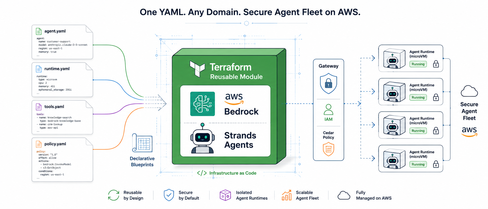

# AWS Agent Platform

[](LICENSE)
[](https://github.com/The-Cloud-Clockwork/tcc-aws-agent-platform/actions/workflows/ci-core.yml)
[](https://the-cloud-clockwork.github.io/tcc-aws-agent-platform/)
[](core/pyproject.toml)

> A configuration-driven, domain-agnostic runtime that lets you declare AI agents in YAML and deploy them on AWS with zero boilerplate — built as an abstraction layer over [Strands Agents SDK](https://github.com/strands-agents/sdk-python) and [Amazon Bedrock AgentCore](https://aws.amazon.com/bedrock/agentcore/).

<p align="center">
  
</p>


**Phase 1** (provider-agnostic inference across `bedrock | anthropic | litellm | vertex`) and **Phase 2** (observability decoupling — Langfuse, Presidio, and provider-agnostic evaluation) are production-validated. Stage 3 (standalone runtime / ECS Fargate / memory optionality) is deferred.

```
Your Domain Repo                          This Platform
-----------------                         -------------
blueprints/
  agents/my-agent.yaml       ------>      BlueprintLoader -> AgentCore Runtime container
  strategies/my-strat.yaml   ------>      StrategyBlueprint -> evaluation engine
  workflows/pipeline.yaml    ------>      Step Functions state machine
prompts/                     ------>      PromptRegistry (versioned, mode-gated)
src/my_agents/
  agent_configs.py           ------>      AgentConfigRegistry (prompt builders)
  mcp_registry.py            ------>      Gateway target registration
  app.py                     ------>      @app.entrypoint -> microVM per session
```

---

## What This Is

A monorepo providing the foundational runtime, tooling, and Terraform infrastructure for AI agent systems on AWS. You define your agents, strategies, and workflows as YAML blueprints in your **domain repo**. This platform turns those declarations into fully operational AWS infrastructure.

**One handler serves every agent.** The YAML blueprint determines which model, tools, prompts, memory strategies, identity providers, and Cedar policies are wired. Domain repos only provide: prompt builders, business schemas, and domain-specific tool implementations.

---

## Packages

| Package | Directory | Purpose |
|---------|-----------|---------|
| `agent-core` | `core/` | Blueprint engine, runtime, hooks, schemas, observability, gateway, memory, identity, policy, evaluation, A2A, MCP base classes |
| `prompt-registry` | `prompts/` | Versioned prompt management — S3 + DynamoDB + mode-gated resolution |
| `mcp-artifacts` | `artifacts/` | Artifact store MCP server — S3 + DynamoDB + signed URLs + claim-check pattern |
| `agent-cli` | `cli/` | CLI for blueprint validation, prompt management, strategy lifecycle |

> **Installation:** packages are distributed via AWS CodeArtifact. See [Getting Started](docs/getting-started/installation.md) for CodeArtifact authentication and `pip install` instructions.

---

## Terraform Infrastructure

| Module | Directory | Purpose |
|--------|-----------|---------|
| `platform` | `modules/platform/` | Core infra — 6 sub-modules (security, data, observability, api, agentcore, prompt_registry). VPC and subnets are consumed as inputs from your networking layer, not managed here. |
| `agents` | `modules/agents/` | Per-agent deployment — blueprint-driven `for_each` over YAML |
| `workflows` | `modules/workflows/` | Step Functions from workflow YAML — parallel branches, choice routing, retry/catch |

**Utility modules** (`modules/lambda/`, `modules/lambda_alarms/`, `modules/scheduled_lambda/`, `modules/s3_encrypted_bucket/`) are reusable building blocks for domain repos building their own Lambda functions, alarms, and encrypted buckets.

Domain repos consume all modules as remote git sources:

```hcl
module "platform" {
  source = "git::https://github.com/The-Cloud-Clockwork/tcc-aws-agent-platform//modules/platform?ref=v1.0.0"
  # ...
}
```

---

## The 12 Building Blocks

Each building block maps a YAML configuration key to a fully wired AWS service. All blocks are optional except Runtime, which is always active.

| # | Block | What It Does |
|---|-------|-------------|
| 1 | **Runtime** | Hosts agents in isolated microVMs per session (`POST /invocations` on port 8080) |
| 2 | **Gateway** | Protocol translator — any backend (Lambda, MCP server, OpenAPI, Smithy) looks like MCP to the agent |
| 3 | **Identity** | JWT inbound auth (Cognito, custom JWT, AWS IAM); API key / OAuth / M2M outbound credentials |
| 4 | **Memory** | Short-term (raw turns with TTL) + long-term (strategy-extracted knowledge via pgvector semantic search) |
| 5 | **Tools** | Managed Code Interpreter (sandboxed Python) + Browser (Chromium); lifecycle managed by AgentCore |
| 6 | **Observability** | OTEL auto-instrumentation, CloudWatch traces, Langfuse integration, audit logging, cost tracking |
| 7 | **Evaluation** | 12 built-in LLM-as-judge evaluators + custom evaluators; agentcore or Langfuse backend |
| 8 | **Policy** | Cedar access control on the Gateway — default DENY, explicit PERMIT per tool |
| 9 | **Strands** | Native Strands Agents SDK integration: BedrockModel, HookProvider, MCPClient, A2AServer |
| 10 | **A2A** | Agent-to-agent communication via the A2A protocol; specialist agents expose an A2A server automatically |
| 11 | **IaC** | Terraform modules as the primary consumable unit for domain repos |
| 12 | **Blueprints** | YAML declarations that wire all 12 blocks — the platform's core abstraction |

---

## Inference Providers

The loader dispatches on `model.provider` via `match/case`. All four providers are production-supported:

| Provider | Value | Notes |
|----------|-------|-------|
| Amazon Bedrock | `bedrock` (default) | Requires `BEDROCK_REGION` env var |
| Anthropic | `anthropic` | Requires `api_key_env` pointing to your Anthropic API key env var |
| LiteLLM proxy | `litellm` | Set `base_url` + `api_key_env`. When `base_url` is set, loader sets `custom_llm_provider="openai"` in client args to prevent LiteLLM's provider heuristic from routing around the proxy. `model_id` is passed through unchanged. |
| Google Vertex / Gemini | `vertex` | Requires Google ADC credentials (`GOOGLE_APPLICATION_CREDENTIALS`, `VERTEX_PROJECT`, `VERTEX_LOCATION`). `api_key_env` and `base_url` are not forwarded for this provider. |

Blueprints with `output_schema` use Strands native `structured_output_model` for all providers (requires strands-agents ≥ 1.41.0).

```yaml
model:
  provider: litellm
  model_id: claude-sonnet-4-6
  base_url: https://llm.example.com
  api_key_env: LITELLM_API_KEY
  extra_headers_env:
    CF-Access-Client-Id: CF_ACCESS_CLIENT_ID
    CF-Access-Client-Secret: CF_ACCESS_CLIENT_SECRET
  temperature: 0.3
  max_tokens: 8192
```

`model_id` supports `${VAR:-default}` env-template expansion at load time, allowing runtime model switching without image rebuilds.

---

## Quick Start

### 0. Create a Domain Repo

```bash
bash <(curl -sL https://raw.githubusercontent.com/The-Cloud-Clockwork/tcc-aws-agent-platform/main/scripts/create-domain.sh)
```

This scaffolds a complete domain repo with agents, MCPs, lambdas, and Terraform — ready for `terraform init`. See [Domain Repo Guide](#domain-repo-guide) for the full structure reference.

### 1. Deploy the Platform

```bash
cd infra/
terraform init
terraform apply -var-file=envs/dev.tfvars
```

The platform module consumes your VPC and subnets as inputs — set `vpc_id`, `public_subnet_ids`, `private_subnet_ids`, and `isolated_subnet_ids` in your tfvars.

### 2. Install the SDK

> **Private registry — not on PyPI.** `agent-core`, `agent-cli`, `prompt-registry`, and `mcp-artifacts` are published to a **private AWS CodeArtifact registry** and are not yet available on PyPI. External users should install directly from source until public distribution is available:
>
> ```bash
> git clone https://github.com/The-Cloud-Clockwork/tcc-aws-agent-platform.git
> cd tcc-aws-agent-platform
> pip install -e "core/"        # agent-core
> pip install -e "cli/"         # agent-cli
> pip install -e "prompts/"     # prompt-registry
> pip install -e "artifacts/"   # mcp-artifacts
> ```
>
> If your organization has CodeArtifact access, authenticate first — see [Installation](docs/getting-started/installation.md).

```bash
# CodeArtifact users: authenticate first — see docs/getting-started/installation.md
pip install agent-core agent-cli
```

### 3. Define a Blueprint

```yaml
# blueprints/agents/my-agent.yaml
id: my-agent
name: My Agent
version: "1.0.0"
prompt_ref: "my-domain/my-agent"

model:
  provider: litellm          # bedrock | anthropic | litellm | vertex
  model_id: claude-sonnet-4-6
  base_url: https://llm.example.com
  api_key_env: LITELLM_API_KEY
  temperature: 0.3
  max_tokens: 8192

runtime:
  type: agentcore
  network_mode: VPC
  idle_timeout_minutes: 15

tools:
  - mcp: data-service-mcp
    tools: [query_data, get_report]
  - builtin: code_interpreter

memory:
  strategies:
    - type: SEMANTIC
      name: FactExtractor
      namespace: "{actorId}/facts/"
  event_expiry_days: 30
  short_term_k: 5
```

### 4. Wire Domain Logic

```python
# agent_configs.py
from agent_core import AgentConfig, AgentConfigRegistry

REGISTRY = AgentConfigRegistry()
REGISTRY.register(AgentConfig(
    agent_id="my-agent",
    operation_name="process",
    required_fields=["date"],
    build_prompt=lambda params, key: f"Process data for {params['date']}...",
))
```

### 5. Create the Handler

```python
# app.py — identical for every domain repo
from agent_core import BlueprintLoader
from agent_core.runtime.entrypoint import AgentCoreApp

app = AgentCoreApp()
loader = BlueprintLoader("blueprints", prompt_dir="prompts")

@app.entrypoint
def handler(payload, context):
    return loader.build_entrypoint(payload["agent_id"])

if __name__ == "__main__":
    app.run()
```

### 6. Validate and Deploy

```bash
agentcli blueprint lint blueprints/agents/my-agent.yaml
agentcli deploy agent blueprints/agents/my-agent.yaml --env production
```

---

## Domain Repo Guide

Domain repos consume this platform by following a **convention-driven folder structure**. The Terraform modules, build scripts, and SDK all rely on specific directory layouts and naming patterns.

### Required Folder Structure

```
my-domain-repo/
├── agents/                            # Agent runtimes (monorepo layout)
│   ├── Dockerfile                     # Shared container image for all agents
│   ├── pyproject.toml                 # Python package (depends on agent-core)
│   ├── src/my_domain_agents/          # Domain agent source code
│   │   ├── app.py                     # Entrypoint — identical across domains
│   │   ├── agent_configs.py           # AgentConfigRegistry + prompt builders
│   │   └── ...
│   ├── blueprints/
│   │   ├── agents/                    # One YAML per agent runtime
│   │   │   ├── my-agent.yaml
│   │   │   └── another-agent.yaml
│   │   ├── strategies/                # Evaluation strategy YAMLs
│   │   │   └── my-strategy.yaml
│   │   └── workflows/                 # Step Functions workflow YAMLs
│   │       └── my-pipeline.yaml
│   └── prompts/
│       └── my-domain/                 # Prompt text files (namespace = prompt_ref prefix)
│           ├── my-agent.txt
│           └── another-agent.txt
├── mcps/                              # MCP servers (polyrepo layout)
│   ├── blueprints/                    # One YAML per MCP server
│   │   ├── data-service-mcp.yaml
│   │   └── another-mcp.yaml
│   ├── data-service/                  # Per-MCP subdirectory (name = blueprint ID minus suffix)
│   │   ├── Dockerfile
│   │   ├── pyproject.toml
│   │   ├── src/
│   │   └── tests/
│   └── another/
│       ├── Dockerfile
│       └── ...
├── lambdas/                           # Lambda functions (domain-managed)
│   ├── my-function/
│   │   └── handler.py
│   └── stubs/                         # Placeholder handlers for workflow steps
│       └── handler.py
├── infra/                             # Terraform — consumes platform modules
│   ├── main.tf                        # Module calls: platform, agents, mcps, workflows
│   ├── variables.tf
│   ├── providers.tf
│   ├── backend.tf
│   ├── envs/
│   │   ├── dev.tfvars
│   │   ├── staging.tfvars
│   │   └── production.tfvars
│   ├── domain_*.tf                    # Domain-specific resources (DynamoDB, Lambda, etc.)
│   └── scripts/                       # Domain infra helper scripts
├── scripts/                           # Domain automation scripts
└── pyproject.toml                     # Root-level dev tooling (ruff, mypy)
```

### Agents — Monorepo Layout

All agents share a **single Docker image**. The YAML blueprint determines behavior at runtime.

| Convention | Expected By |
|-----------|-------------|
| `agents/Dockerfile` at root | `build-runtime.sh` — fails if missing |
| `agents/pyproject.toml` | Zipped into CodeBuild source |
| `agents/src/` | Zipped into CodeBuild source |
| `agents/blueprints/` | Zipped into image + loaded by `BlueprintLoader` |
| `agents/prompts/` | Zipped into image (optional, for local prompt fallback) |

**Terraform wiring:**

```hcl
module "agents" {
  source = "git::https://github.com/The-Cloud-Clockwork/tcc-aws-agent-platform//modules/agents?ref=v1.0.0"

  blueprint_dir  = "${path.module}/../agents/blueprints/agents"
  source_dir     = "${path.root}/../agents"
  source_layout  = "monorepo"              # Single shared Dockerfile
  build_enabled  = var.build_enabled
  # ... platform outputs wired from module.platform.*
}
```

**The `app.py` entrypoint is identical for every domain:**

```python
from agent_core import BlueprintLoader
from agent_core.runtime.entrypoint import AgentCoreApp

app = AgentCoreApp()
loader = BlueprintLoader("blueprints", prompt_dir="prompts")

@app.entrypoint
def handler(payload, context):
    return loader.build_entrypoint(payload["agent_id"])

if __name__ == "__main__":
    app.run()
```

**Build flow:** `terraform apply -var="build_enabled=true"` triggers `build-runtime.sh` which:
1. Zips `Dockerfile`, `pyproject.toml`, `src/`, `blueprints/`, `prompts/`
2. Uploads to S3 (`codebuild_source_bucket`)
3. Triggers CodeBuild with `sourceLocationOverride` (NO_SOURCE pattern)
4. CodeBuild authenticates to CodeArtifact, builds ARM64 image, pushes to ECR

### MCP Servers — Polyrepo Layout

Each MCP server has its **own subdirectory with its own Dockerfile**.

| Convention | Expected By |
|-----------|-------------|
| `mcps/blueprints/` contains `*.yaml` | Terraform `fileset()` for `for_each` |
| Blueprint `id` field ends with configured suffix (default: `-mcp`) | `build-runtime.sh` strips suffix to find subdir |
| `mcps/{name}/Dockerfile` | `build-runtime.sh` — fails if missing |

**Name derivation:** The build system strips `polyrepo_suffix` from the blueprint ID to find the subdirectory:
- Blueprint ID `data-service-mcp` with suffix `-mcp` → looks for `mcps/data-service/Dockerfile`

**Terraform wiring:**

```hcl
module "mcps" {
  source = "git::https://github.com/The-Cloud-Clockwork/tcc-aws-agent-platform//modules/agents?ref=v1.0.0"

  resource_prefix  = "${var.resource_prefix}-mcp"    # Distinguish from agent resources
  blueprint_dir    = "${path.module}/../mcps/blueprints"
  source_dir       = "${path.root}/../mcps"
  source_layout    = "polyrepo"                       # Per-service Dockerfiles
  polyrepo_suffix  = "-mcp"                           # Strip to find subdir name
  build_enabled    = var.build_enabled

  # Shared code injection (optional)
  extra_build_deps = {
    "my-mcp" = "shared-lib:deps/shared-lib"           # src_path:zip_path
  }
}
```

### Lambdas

Lambda functions are **not managed by platform modules** — the domain's `infra/` declares `aws_lambda_function` resources directly, or uses the `modules/lambda/` utility module.

Lambdas integrate with the platform through **workflow blueprints**:
- Workflow YAML references functions via `lambda_ref: my-function`
- `infra/main.tf` passes `lambda_arns = { "my-function" = aws_lambda_function.my_fn.arn }` to the workflows module

Convention: one directory per function under `lambdas/`. A `stubs/` directory holds placeholder handlers for workflow steps not yet implemented.

### Infrastructure (infra/)

The `infra/` directory makes **three to four module calls** in dependency order:

```
platform  →  agents   →  workflows
              mcps   ↗
```

```hcl
# 1. Platform foundation (KMS, DynamoDB, Gateway, Memory, API)
#    Note: VPC and subnets come from YOUR networking layer as inputs.
module "platform" {
  source = "git::https://github.com/The-Cloud-Clockwork/tcc-aws-agent-platform//modules/platform?ref=v1.0.0"
  environment         = var.environment
  resource_prefix     = var.resource_prefix
  vpc_id              = var.vpc_id
  public_subnet_ids   = var.public_subnet_ids
  private_subnet_ids  = var.private_subnet_ids
  isolated_subnet_ids = var.isolated_subnet_ids
  # ...
}

# 2a. Agent runtimes (depends on platform)
module "agents" {
  source     = "git::https://github.com/The-Cloud-Clockwork/tcc-aws-agent-platform//modules/agents?ref=v1.0.0"
  depends_on = [module.platform]

  blueprint_dir           = "${path.module}/../agents/blueprints/agents"
  gateway_id              = module.platform.gateway_id
  gateway_url             = module.platform.gateway_url
  memory_id               = module.platform.memory_id
  vpc_id                  = module.platform.vpc_id
  private_subnet_ids      = module.platform.private_subnet_ids
  agent_security_group_id = module.platform.agent_security_group_id
  # ... remaining platform outputs
}

# 2b. MCP runtimes (depends on platform, uses same agents module)
module "mcps" {
  source     = "git::https://github.com/The-Cloud-Clockwork/tcc-aws-agent-platform//modules/agents?ref=v1.0.0"
  depends_on = [module.platform]

  resource_prefix = "${var.resource_prefix}-mcp"
  blueprint_dir   = "${path.module}/../mcps/blueprints"
  source_layout   = "polyrepo"
  polyrepo_suffix = "-mcp"
  # ... same platform outputs
}

# 3. Workflows (depends on agents for runtime ARNs)
module "workflows" {
  source     = "git::https://github.com/The-Cloud-Clockwork/tcc-aws-agent-platform//modules/workflows?ref=v1.0.0"
  depends_on = [module.agents]

  workflow_dir       = "${path.module}/../agents/blueprints/workflows"
  agent_runtime_arns = module.agents.runtime_arns
  lambda_arns        = { "my-fn" = aws_lambda_function.my_fn.arn }
}
```

**Domain-specific resources** go in `domain_*.tf` files (e.g., `domain_data.tf` for DynamoDB tables, `domain_lambdas.tf` for Lambda functions).

### Blueprint Conventions

Blueprints are the platform's core abstraction. Both Terraform and the SDK rely on these conventions:

| Rule | Enforced By |
|------|-------------|
| Files must be `*.yaml` (not `.yml` for Terraform) | `fileset(dir, "*.yaml")` in `locals.tf` |
| Each file must have a top-level `id` field | Terraform `yamldecode().id` for `for_each` key |
| The `id` is used for all resource naming | ECR repos, CodeBuild projects, IAM roles, runtimes |
| IDs use kebab-case by convention | All shipped examples use kebab-case (e.g., `my-agent`, `data-service-mcp`) |
| Agent blueprints live in `blueprints/agents/` | `BlueprintLoader._find_yaml("agents", id)` |
| Strategy blueprints live in `blueprints/strategies/` | `BlueprintLoader._find_yaml("strategies", id)` |
| Workflow blueprints live in `blueprints/workflows/` | `BlueprintLoader._find_yaml("workflows", id)` |

The SDK's `BlueprintLoader` accepts both `.yaml` and `.yml` extensions and also falls back to scanning by `id` field. Terraform's `fileset()` only matches `*.yaml`.

### Build System

Builds are triggered by Terraform and executed by CodeBuild:

```bash
# Build all agents/MCPs
terraform apply -var="build_enabled=true"

# Build a single service
terraform apply -var="build_enabled=true" -var='build_services={"my-agent":true}'
```

The `build-runtime.sh` script (embedded in the agents module) handles:
1. **Zip** — source code into a temporary archive
2. **Upload** — zip to S3 (`codebuild_source_bucket`)
3. **Trigger** — CodeBuild with `--source-type-override S3 --source-location-override`
4. **Poll** — wait for build completion

CodeBuild projects authenticate to CodeArtifact automatically via the inline buildspec, so `agent-core` (and any other platform packages) resolve during `pip install`.

### Observability

The platform includes `observe-runtime.sh` for runtime monitoring:

```bash
# Summary table of all runtimes
./modules/agents/scripts/observe-runtime.sh

# Filter by type
./modules/agents/scripts/observe-runtime.sh --agents
./modules/agents/scripts/observe-runtime.sh --mcps

# Drill into a specific runtime
./modules/agents/scripts/observe-runtime.sh my-agent --logs
./modules/agents/scripts/observe-runtime.sh my-agent --traces
./modules/agents/scripts/observe-runtime.sh my-agent --metrics
./modules/agents/scripts/observe-runtime.sh my-agent --all
```

Log groups follow the pattern: `/aws/bedrock-agentcore/runtimes/{runtime-short-name}`

Platform deploys FIRST. Domain repos deploy SECOND.

---

## Development

```bash
# Install all packages in editable mode
pip install -e "core/[dev]"       # agent-core
pip install -e "prompts/[dev]"    # prompt-registry
pip install -e "artifacts/[dev]"  # mcp-artifacts
pip install -e "cli/[dev]"        # agent-cli

# Lint and format
ruff check .
ruff format --check .

# Type checking
mypy core/src/
```

Tests run through CI only — push to `dev` and monitor via `gh run list`.

---

## Documentation

Full documentation at **[the-cloud-clockwork.github.io/tcc-aws-agent-platform](https://the-cloud-clockwork.github.io/tcc-aws-agent-platform/)**

| Section | Content |
|---------|---------|
| [Getting Started](docs/getting-started.md) | Installation, quickstart, first agent tutorial |
| [Concepts](docs/concepts.md) | Mental models for the 12 building blocks |
| [Blueprints](docs/blueprints.md) | Agent, strategy, and workflow YAML specs |
| [Inference Providers](docs/inference.md) | Provider guide — Bedrock, Anthropic, LiteLLM, Vertex |
| [Observability & Evaluation](docs/observability.md) | Langfuse, CloudWatch, Presidio, cost tracking, evaluation |
| [Identity, Policy & IAM](docs/policy.md) | JWT auth, Cedar policies, IAM role scoping |
| [Tools, MCP & Gateway](docs/tools.md) | Gateway targets, MCP servers, builtin tools, artifacts |
| [Runtime & Memory](docs/runtime.md) | AgentCore Runtime, memory strategies, A2A, prompts |
| [Infrastructure](docs/infrastructure.md) | Terraform module reference |
| [SDK Reference](docs/sdk.md) | API reference for all subsystems |
| [CLI Reference](docs/cli.md) | Command reference for `agentcli` |

---

## Contributing

Contributions are welcome. Please open an issue to discuss significant changes before submitting a pull request.

- [CONTRIBUTING.md](CONTRIBUTING.md) — coding conventions, branch policy, and CI/test requirements
- [CODE_OF_CONDUCT.md](CODE_OF_CONDUCT.md) — community standards
- [SECURITY.md](SECURITY.md) — how to report vulnerabilities responsibly

---

## License

Licensed under the Apache License, Version 2.0 — see [`LICENSE`](LICENSE) and [`NOTICE`](NOTICE). Copyright 2026 The Cloud Clockwork.
