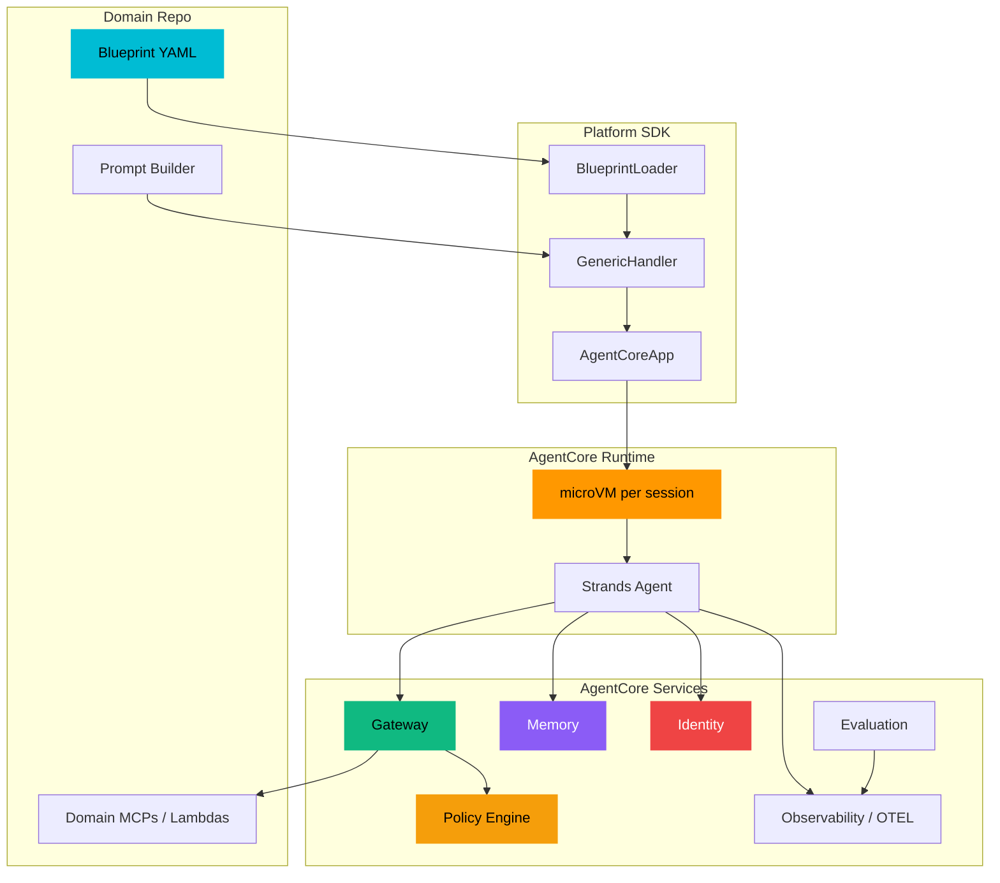

# Architecture

The AWS Agent Platform is an abstraction layer over 12 AgentCore concepts. Each concept maps from a YAML declaration in your blueprint to a fully wired AWS service. This section explains the design, the components, and how they connect.

---

## In This Section

| Page | What It Covers |
|------|----------------|
| [The 12 Building Blocks]({{ '/docs/architecture/building-blocks' | relative_url }}) | Every block from Runtime to Blueprints — YAML snippets, service wiring, and data flows |
| [Platform vs. Domain]({{ '/docs/architecture/platform-vs-domain' | relative_url }}) | Responsibility matrix, the "bundle" concept, directory structure comparison |
| [How It Works]({{ '/docs/architecture/how-it-works' | relative_url }}) | End-to-end flows: blueprint to running agent, request, memory, identity, multi-agent |

---

## The Full Stack

---

## Design Principles

**Configuration-driven.** Everything an agent needs — model, tools, memory strategies, identity patterns, Cedar policies, evaluators — is declared in a YAML blueprint. The platform assembles it. Domain developers do not write runtime wiring code.

**Domain-agnostic.** The platform does not know or care what your agents do. It provides the infrastructure primitives; you bring the business logic as prompt builders, domain schemas, and tool implementations.

**Separation of concerns.** The platform repo and domain repos have a clear contract. The platform provides the SDK, Terraform modules, and CLI. Domain repos provide blueprint YAML, prompt builders, and domain-specific MCPs and Lambdas.

**Hard dependencies.** Strands Agents SDK and Amazon Bedrock AgentCore are required. The platform does not provide fallbacks or compatibility shims.

---

## Next Steps

Start with [The 12 Building Blocks]({{ '/docs/architecture/building-blocks' | relative_url }}) for a bottom-up understanding of each component, then read [How It Works]({{ '/docs/architecture/how-it-works' | relative_url }}) to see the end-to-end flows.
