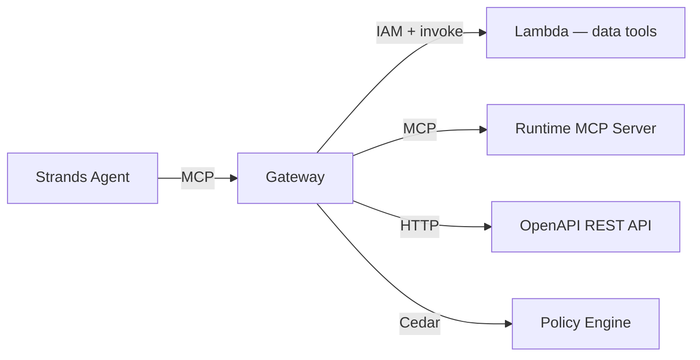
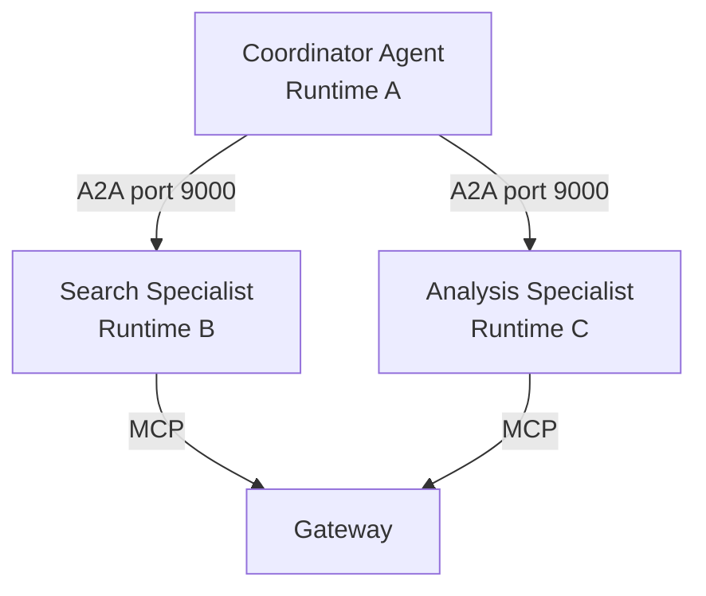

# The 12 Building Blocks

The platform is an abstraction layer over 12 AgentCore concepts. Each one maps from a YAML declaration in your blueprint to a fully wired AWS service. The developer declares *what*; the platform handles *how*.

---

## Overview

```
+-----------------+     +--------------+     +--------------+
|  Agent (microVM) |---->|   Gateway    |---->|  Lambda fn   |
|  Long-running    |     |  (MCP proxy) |     |  Short, fast |
|  Stateful        |     |              |     |  Stateless   |
|  Streaming       |     |              |     |  < 30s       |
+-----------------+     +--------------+     +--------------+
```

Agents live on **Runtime**. Tools live on **Lambda** (or any backend). **Gateway** bridges them. Everything else — Memory, Identity, Policy, Observability, Evaluation — wraps around the agent at the Runtime layer.

---

## Block 1: Runtime {#runtime}

AgentCore Runtime hosts agents in **isolated microVMs per session**. The contract: expose `POST /invocations` and `GET /ping` on port 8080. Runtime handles scaling, warm pools, session routing, TLS, and lifecycle management. Each user session gets its own isolated microVM; sessions auto-terminate after an idle timeout (default: 15 minutes) or a maximum lifetime of 8 hours.

**What the platform does:** `BlueprintLoader` reads the agent YAML, resolves all dependencies, and produces a Strands `Agent` wired to `@app.entrypoint`. The developer never writes the entrypoint — the platform generates it from configuration.

```yaml
runtime:
  type: agentcore          # microVM hosting (not Lambda)
  max_iterations: 10
  idle_timeout_minutes: 15
  network_mode: PRIVATE    # VPC-only; use PUBLIC for internet-accessible agents
  protocol: HTTP           # or MCP for hosting an MCP server on Runtime
```

**Key point:** Agents are not Lambda functions. Lambda is for tools — short, stateless, fast functions called by agents. Agents are stateful, long-running, and session-oriented. Runtime is the correct host.

```
Blueprint YAML → BlueprintLoader → AgentCoreApp → Docker → ECR → AgentCore Runtime → microVM
```

---

## Block 2: Gateway {#gateway}

Gateway is a **protocol translator** that makes any backend look like an MCP server. Agents speak MCP to Gateway; Gateway speaks whatever the backend requires — Lambda invocations, REST calls, OpenAPI schemas, Smithy APIs, or other MCP servers.

**What the platform does:** The blueprint's `tools:` section declares MCP server names. The platform registers these as Gateway targets and configures the agent to consume them through a single Gateway URL via Strands `MCPClient`. Domain repos never manage MCP connections directly.

```yaml
tools:
  - mcp: data-tools-mcp
    tools: [get_record, search_records]
  - mcp: artifact-store-mcp
    tools: [create_artifact, get_artifact]
  - builtin: code_interpreter
  - builtin: browser
```

**Data flow:**



The agent sees all tools — local, Lambda-backed, REST-backed, built-in — as equivalent MCP tools. Gateway handles routing, auth, and protocol translation transparently.

---

## Block 3: Identity {#identity}

Four authentication patterns, all declared in YAML:

| Pattern | Use Case | YAML Key |
|---------|----------|----------|
| Inbound JWT | Validate who can call your agent | `identity.authorizer` |
| Outbound API Key | Agent needs a third-party API key | `identity.credentials[].type: api_key` |
| 3-Legged OAuth | Agent needs user's OAuth token (Google, GitHub, etc.) | `identity.credentials[].type: oauth_3lo` |
| M2M | Agent-to-agent authentication | `identity.credentials[].type: m2m` |

**What the platform does:** Reads the identity block, configures Runtime JWT validation (so invalid tokens are rejected before your code runs), registers credential providers with AgentCore Identity, and injects the appropriate decorators into the generated agent code.

```yaml
identity:
  authorizer:
    type: cognito_jwt
    user_pool_id: ${COGNITO_POOL_ID}
    client_id: ${COGNITO_CLIENT_ID}
  credentials:
    - name: external-api-key
      type: api_key
      provider: external-apikey-provider
    - name: calendar-access
      type: oauth_3lo
      scopes: ["https://www.googleapis.com/auth/calendar.readonly"]
```

Credentials are stored in Secrets Manager and fetched at runtime by the Identity service. They never appear in your codebase, environment variables, or container image.

---

## Block 4: Memory {#memory}

AgentCore Memory provides two tiers: **short-term** (raw conversation events with TTL) and **long-term** (strategy-extracted knowledge in pgvector with semantic retrieval).

**What the platform does:** The blueprint declares memory strategies. The platform generates a Strands `HookProvider` that loads conversation history and semantic memories when the agent initialises, and persists each turn as it is added.

```yaml
memory:
  mode: MANAGED
  strategies:
    - type: USER_PREFERENCE
      name: PreferenceLearner
      namespace: "user/{actorId}/preferences/"
    - type: SEMANTIC
      name: FactExtractor
      namespace: "user/{actorId}/facts/"
    - type: SUMMARY
      name: Summarizer
      namespace: "user/{actorId}/{sessionId}/summaries/"
  event_expiry_days: 30
  short_term_k: 5
```

**Memory tiers:**

```
create_event() --> Short-Term (Raw events, TTL)
                        |
                        +-- async extraction (~30s) --> Long-Term (pgvector)
                                                              |
                                                    retrieve_memories()
                                                    semantic similarity search
```

**Memory branching** for multi-agent pipelines: each sub-agent writes to its own branch; the coordinator reads from all branches. Declared in the workflow blueprint, not coded by the developer.

---

## Block 5: Tools — Code Interpreter and Browser {#tools}

AgentCore provides two managed built-in tools: **Code Interpreter** (sandboxed Python and shell execution) and **Browser** (hosted Chromium with Nova Act). These are AWS-managed services — the platform registers them as Gateway targets when declared.

```yaml
tools:
  - builtin: code_interpreter
  - builtin: browser
  - mcp: my-domain-mcp
    tools: [domain_tool_1]
```

The agent sees all tools — local, Gateway-routed, Code Interpreter, Browser — as equivalent. It does not know or care where each tool runs.

---

## Block 6: Observability {#observability}

AgentCore uses OTEL auto-instrumentation. Every LLM call, tool call, and error is traced end-to-end and sent to CloudWatch GenAI Observability.

**What the platform does:** The generated Dockerfile includes `aws-opentelemetry-distro` and wraps the entrypoint with `opentelemetry-instrument`. The blueprint's `trace_attributes` appear on every span. Domain developers get full observability without writing tracing code.

```yaml
observability:
  enabled: true
  trace_attributes:
    environment: production
    agent.version: "2.1.0"
    tags: ["customer-support", "tier-1"]
  langfuse:
    enabled: true
  audit_log:
    enabled: true
    ttl_years: 5
```

A trace for a single invocation captures:

```
Trace: session_abc / invocation_1
+-- Agent Invocation (2.3s total)
|   +-- LLM Call #1 (0.8s) — tokens: 142 in / 67 out
|   |   +-- Tool Decision: get_record(id="123")
|   +-- Tool Call: get_record (0.1s)
|   +-- LLM Call #2 (0.6s) — tokens: 203 in / 89 out
|   +-- Final Response
```

---

## Block 7: Evaluation {#evaluation}

AgentCore Evaluation reads OTEL traces and scores agent behaviour with LLM-as-judge. 13 built-in evaluators cover response quality, task completion, tool usage accuracy, and safety.

**What the platform does:** The blueprint declares which evaluators to run and at what sampling rate. The platform configures online evaluation (continuous production monitoring) against the agent's live OTEL traces.

```yaml
evaluation:
  online:
    sampling_rate: 100
    evaluators:
      - Builtin.GoalSuccessRate
      - Builtin.Correctness
      - Builtin.ToolSelectionAccuracy
  custom_evaluators:
    - name: policy_compliance
      instructions: "Did the agent follow the domain policy? Score 1.0 if fully compliant..."
      scale: [1.0, 0.5, 0.0]
```

| Category | Built-in Evaluators |
|----------|-------------------|
| Response quality | Correctness, Completeness, Faithfulness, Helpfulness, Coherence, Relevance |
| Task completion | GoalSuccessRate |
| Tool usage | ToolSelectionAccuracy, ToolParameterAccuracy |
| Safety | Harmlessness, Harmfulness, Stereotyping |

---

## Block 8: Policy {#policy}

Cedar policies on Gateway control who can call which tools with which parameters. The default action is **DENY** — you explicitly permit what is allowed.

**What the platform does:** The blueprint declares access rules in a simplified format. The platform generates Cedar policies and attaches them to the Gateway's policy engine.

```yaml
policy:
  engine: DomainPolicies
  mode: ENFORCE   # or LOG_ONLY for testing without blocking
  rules:
    - name: write_limit
      allow: create_record
      when: "context.input.content.length <= 50000"
    - name: admin_only_delete
      deny: delete_record
      unless: "principal.scope.contains('group:Admins')"
```

Policy operates at the Gateway level, not the Runtime level. The agent calls tools normally; policy silently allows or denies based on the end-user's JWT claims.

---

## Block 9: Strands Integration {#strands}

Strands is the primary agent framework because it has the deepest AgentCore integration: native `BedrockModel`, `HookProvider` for Memory, `MCPClient` for Gateway, `A2AServer` for agent-to-agent communication, and `trace_attributes` for OTEL.

**What the platform does:** `BlueprintLoader` produces a fully wired Strands `Agent` with:

- `BedrockModel` configured from the `model:` block
- Gateway tools via `MCPClient` from the `tools:` block
- Memory `HookProvider` from the `memory:` block
- Identity decorators from the `identity:` block
- OTEL `trace_attributes` from the `observability:` block
- All wrapped in `@app.entrypoint` for AgentCore Runtime

The developer declares all of this in YAML. The platform assembles it.

---

## Block 10: Agent-to-Agent (A2A) {#a2a}

A2A lets agents discover and call each other via a standardised protocol on port 9000. Each agent publishes an agent card at `/.well-known/agent-card.json`.

**What the platform does:** When a blueprint declares `multi_agent:`, the platform generates an `A2AServer` for the agent, registers M2M credential providers for cross-agent auth, and wraps remote agent calls as Strands `@tool` functions. The coordinator agent sees specialist agents as regular tools.

```yaml
multi_agent:
  type: graph
  role: coordinator
  nodes:
    - agent_ref: search-specialist
      a2a_url: ${SEARCH_AGENT_URL}
    - agent_ref: analysis-specialist
      a2a_url: ${ANALYSIS_AGENT_URL}
```

**Multi-agent topology:**



Each specialist can use a different model, different tools, or even be deployed in a different AWS account. A2A abstracts the transport; coordinators see specialists as opaque tools.

---

## Block 11: Infrastructure as Code {#iac}

Terraform modules are the primary consumption unit. Domain repos use `module "platform" { source = "..." }` to deploy the entire stack.

```hcl
# Domain repo: infra/main.tf
module "platform" {
  source = "git::https://github.com/org/aws-agent-platform//modules/platform?ref=v1.0.0"

  environment   = "production"
  vpc_id        = module.network.vpc_id
  agents_config = "./blueprints/agents/"
}

module "domain_agents" {
  source = "git::https://github.com/org/aws-agent-platform//modules/agents?ref=v1.0.0"

  platform_outputs = module.platform.outputs
  blueprints_dir   = "./blueprints/"
}
```

The platform infrastructure (Gateway, Memory, Identity, Observability, data stores) is deployed once per account. Every domain repo sharing the same account shares the same platform stack.

---

## Block 12: Blueprints {#blueprints}

Blueprints are the platform's core innovation: YAML files that declare everything an agent needs, and the platform assembles it.

Three blueprint types:

| Type | Declares | Produces |
|------|----------|----------|
| **Agent** | Model, tools, prompt, memory, identity, policy, observability | AgentCore Runtime container with full Strands agent |
| **Strategy** | Trigger conditions, parameter logic, required inputs | Evaluated by a strategy-evaluator agent |
| **Workflow** | Multi-agent DAG with parallel branches, choice routing, retry/catch | Step Functions state machine |

This is the platform's differentiator. Everything else (Gateway, Memory, Identity, Policy) is AWS-managed infrastructure. The blueprint layer turns "12 separate AWS services" into "one YAML file per agent."

---

## Execution Mode Isolation {#execution-mode}

`EXECUTION_MODE` is a first-class concept that affects every building block simultaneously. It controls which prompts are resolved, which data sources are queried, and which execution targets receive tool calls.

| Mode | Prompts | Data Sources | Execution Targets |
|------|---------|-------------|------------------|
| `simulation` | Simulation-mode variants | Synthetic / sandboxed data | Dry-run handlers |
| `staging` | Staging variants | Staging data stores | Staging backends |
| `production` | Production variants | Live data | Live backends |

Every prompt resolution, Gateway target call, and Memory namespace is mode-aware. Switching modes switches the entire agent's behaviour end-to-end — from the PromptRegistry returning different prompt versions to the Gateway routing to different backend environments.

This means you can run a full agent pipeline in `simulation` mode against synthetic data with dry-run handlers, then promote to `staging` for integration testing, and finally to `production` — without changing any agent code or blueprint YAML. The mode is set via the `EXECUTION_MODE` environment variable at deployment time.

---

## Next Steps

- [Platform vs. Domain]({{ '/docs/architecture/platform-vs-domain' | relative_url }}) — responsibility matrix and directory structure
- [How It Works]({{ '/docs/architecture/how-it-works' | relative_url }}) — end-to-end flows with Mermaid diagrams
- [First Agent]({{ '/docs/getting-started/first-agent' | relative_url }}) — build all 12 blocks into a running agent
