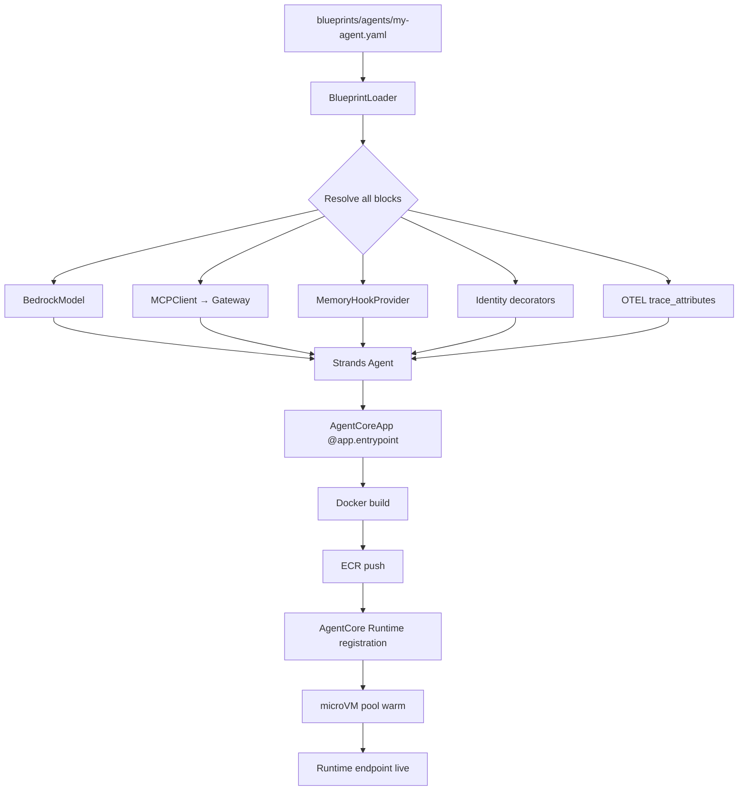
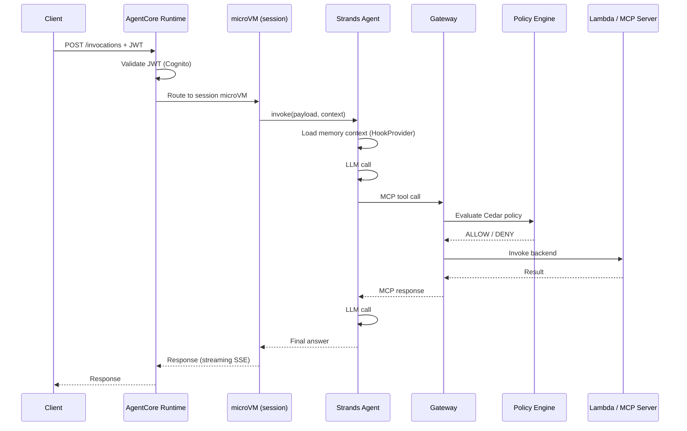
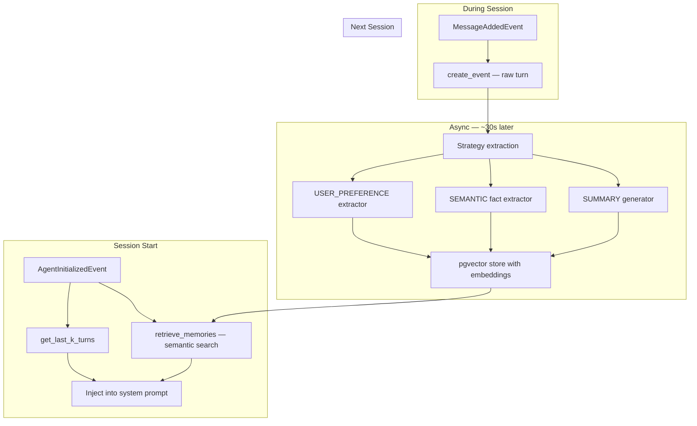
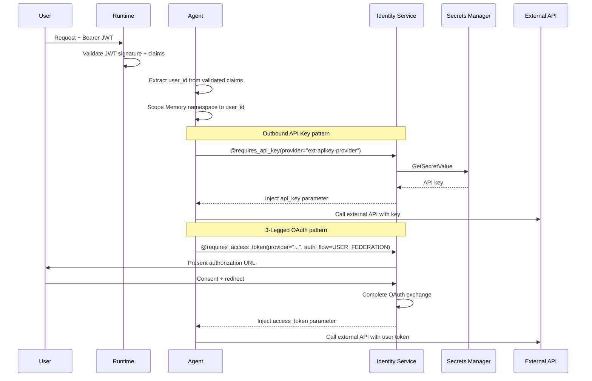
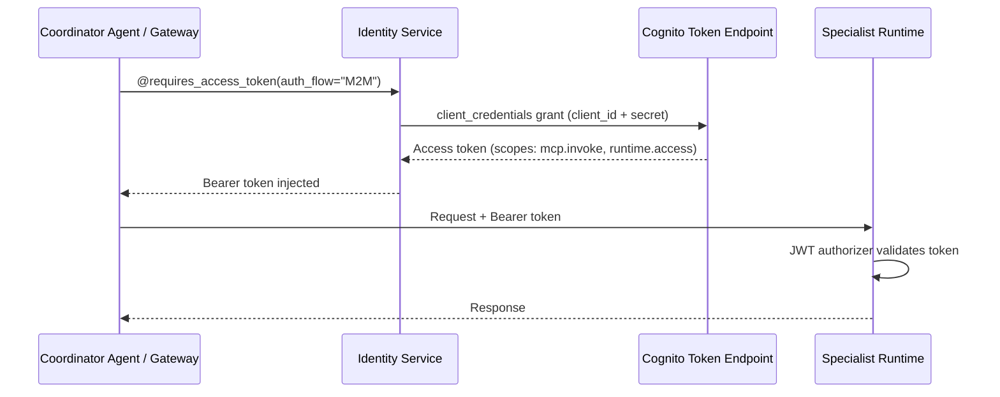
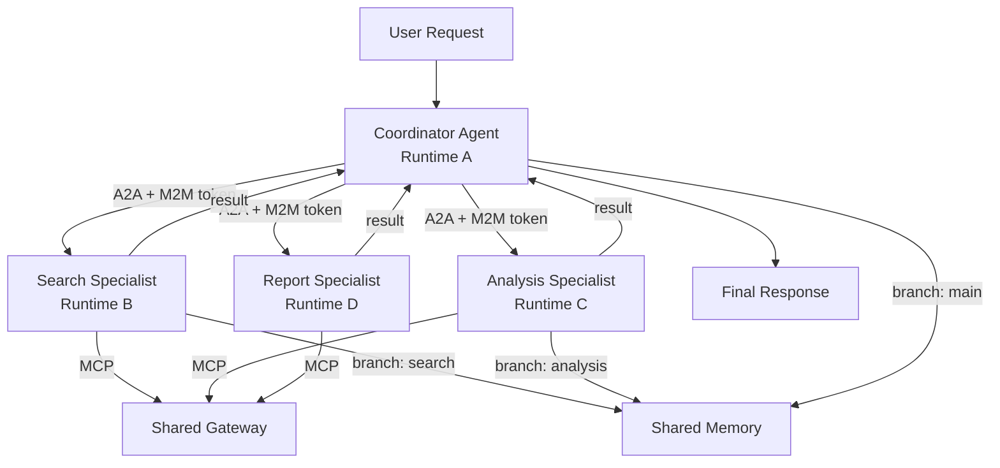

# How It Works

End-to-end flows for the five core scenarios: blueprint to running agent, request processing, memory persistence, identity delegation, and multi-agent coordination.

---

## 1. Blueprint to Running Agent

The full lifecycle from a YAML file to a live Runtime endpoint.



**Step-by-step:**

1. `agentcli deploy` calls `BlueprintLoader` with the YAML path.
2. `BlueprintLoader` validates the schema and resolves every block — model config, tool targets, memory strategy parameters, identity configuration, OTEL attributes, evaluator list.
3. It produces a fully wired Strands `Agent` instance and wraps it in `AgentCoreApp` with `@app.entrypoint`.
4. The CLI generates a production `Dockerfile` that includes `aws-opentelemetry-distro`, copies the agent source, and wraps the entrypoint command with `opentelemetry-instrument`.
5. The image is built and pushed to the ECR repository provisioned by the agents Terraform module.
6. The CLI calls the AgentCore control plane to create or update the Runtime with the new image digest, IAM execution role, network config, and JWT authorizer.
7. AgentCore warms a pool of microVMs. The endpoint is live.

**Total developer effort:** Write the YAML blueprint + prompt builder. Run `agentcli deploy`. The platform handles steps 2 through 7.

---

## 2. Request Flow

How a client request travels from ingress to agent response.



**Key points:**

- JWT validation happens at the Runtime boundary, before your code runs. Invalid tokens never reach the agent.
- The Gateway's Cedar policy engine evaluates every tool call. The agent is unaware of policy decisions — it calls tools normally and receives either a result or an access denied error.
- Streaming responses flow back over SSE. The microVM stays alive for the session lifetime, maintaining state across turns.

---

## 3. Memory Flow

How conversation history and long-term knowledge are persisted and retrieved.



**Namespace pattern:**

Memory is scoped by namespace placeholders that resolve at runtime:

```
/preferences/{actorId}/        ← per-user, shared across all sessions
/facts/{actorId}/              ← per-user facts, shared across all sessions
/summaries/{actorId}/{sessionId}/  ← per-session summary
```

This means a user's preferences learned in session 1 are automatically available in session 100 — without the developer writing any retrieval logic.

**Memory branching** in multi-agent pipelines: each sub-agent writes to a named branch; the coordinator can read from any branch. This allows the coordinator to synthesise outputs from multiple specialists without the specialists sharing memory with each other.

---

## 4. Identity Flow

How user identity and credentials flow through the system.



**The key principle — delegation, not impersonation.** The agent authenticates as itself while carrying verifiable user context. It never pretends to be the user. The backend sees both: the agent's identity (for audit) and the user's authorisation (for access control decisions).

### M2M Auth Flow (Agent-to-Agent)

When agents call other agents or when the Gateway invokes MCP servers hosted on Runtime, the platform uses the `client_credentials` grant for machine-to-machine authentication:



Each agent or Gateway gets its own Cognito client credentials. The Identity service handles token caching and refresh automatically. No application code changes are needed for this flow.

---

## 5. Multi-Agent Flow

How a coordinator delegates work to specialist agents via A2A.



**A2A protocol details:**

1. Each agent publishes `/.well-known/agent-card.json` describing its capabilities.
2. The coordinator discovers specialists at startup by resolving their agent cards.
3. Cross-agent calls use M2M OAuth tokens issued by AgentCore Identity — no hardcoded credentials.
4. Specialists are wired as regular Strands `@tool` functions on the coordinator. The LLM sees them as tools; A2A handles the transport.
5. Memory branching isolates each specialist's working memory. The coordinator can read all branches; specialists cannot read each other's.

**From the blueprint:**

```yaml
# Coordinator blueprint
multi_agent:
  type: graph
  role: coordinator
  nodes:
    - agent_ref: search-specialist
      a2a_url: ${SEARCH_AGENT_URL}
    - agent_ref: analysis-specialist
      a2a_url: ${ANALYSIS_AGENT_URL}
```

The platform generates the `A2AServer` on the specialist, the `A2AClient` on the coordinator, and the M2M credential flow between them — from this six-line YAML declaration.

---

## Execution Mode Isolation

`EXECUTION_MODE` is a first-class concept that controls behaviour across all five flows simultaneously:

| Mode | Prompts | Data Sources | Execution Targets |
|------|---------|-------------|------------------|
| `simulation` | Simulation-mode variants | Synthetic / sandboxed data | Dry-run handlers |
| `staging` | Staging variants | Staging data stores | Staging backends |
| `production` | Production variants | Live data | Live backends |

Every prompt resolution, Gateway target call, and Memory namespace is mode-aware. Switching modes switches the entire agent's behaviour end-to-end.

---

## Next Steps

- [The 12 Building Blocks]({{ '/docs/architecture/building-blocks' | relative_url }}) — deep dive into each component
- [Platform vs. Domain]({{ '/docs/architecture/platform-vs-domain' | relative_url }}) — responsibility matrix
- [SDK Reference — Runtime]({{ '/docs/sdk/runtime' | relative_url }}) — `AgentCoreApp`, `GenericHandler`, `BlueprintLoader`
- [SDK Reference — Memory]({{ '/docs/sdk/memory' | relative_url }}) — `MemoryManager`, `MemoryHookProvider`, branching
- [SDK Reference — A2A]({{ '/docs/sdk/a2a' | relative_url }}) — `A2AServerWrapper`, `A2AClient`, `A2AWiring`
