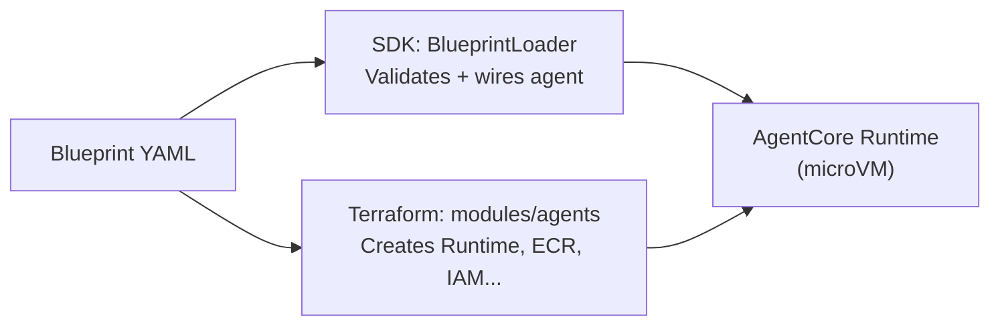

# Blueprints

Blueprints are the core configuration abstraction of the AWS Agent Platform. A blueprint is a YAML file that fully declares a resource — its model, runtime behaviour, tools, memory, identity, observability, and access-control policy. The platform reads blueprint YAML at both SDK load time and Terraform plan time, driving code execution and infrastructure provisioning from a single source of truth.

---

## Blueprint Types

| Type | File Convention | Purpose | Terraform Consumer |
|------|-----------------|---------|-------------------|
| **Agent** | `blueprints/agents/*.yaml` | Declares a single AI agent: model, runtime, tools, memory, identity, observability, evaluation, policy | `modules/agents` |
| **Strategy** | `blueprints/strategies/*.yaml` | Declares an evaluation strategy: entry/exit conditions, parameters, evaluation criteria, risk controls | Domain-specific modules |
| **Workflow** | `blueprints/workflows/*.yaml` | Declares a multi-agent pipeline: state machine structure, agent references, parallel branches, retry logic | `modules/workflows` |

---

## Directory Layout

```
blueprints/
  agents/
    researcher.yaml       # one file per agent
    synthesizer.yaml
  strategies/
    confidence-threshold.yaml
  workflows/
    analysis-pipeline.yaml
```

Blueprint IDs use **kebab-case** by convention (matching the shipped example blueprints). The schema enforces no specific format, but kebab-case is the standard across all platform tooling.

---

## How Blueprints Are Consumed

At **SDK load time**, `BlueprintLoader` reads YAML from disk, validates it against the Pydantic schemas in `agent_core.schemas` and `agent_core.blueprints`, and returns a typed object that drives runtime wiring — model construction, hook registration, memory setup, gateway connection, and policy engine attachment.

At **Terraform plan time**, `modules/agents` and `modules/workflows` call `fileset()` and `yamldecode()` over the same YAML files and provision the corresponding AWS resources (AgentCore Runtimes, ECR repositories, IAM roles, Step Functions state machines) per blueprint entry.



---

## Env-Template Expansion

String fields in blueprints support `${VAR}` and `${VAR:-default}` expansion at load time. This is most commonly used in `model.model_id` to allow runtime model selection without image rebuilds:

```yaml
model:
  provider: litellm
  model_id: ${AGENT_MODEL_ID:-claude-sonnet-4-6}
```

If `AGENT_MODEL_ID` is set in the environment, that value is used. Otherwise `claude-sonnet-4-6` is the fallback. The `vertex` provider uses `os.path.expandvars` for the same effect.

---

## Blueprint Validation

Blueprints are validated at load time by Pydantic v2. Invalid blueprints fail loudly — there are no silent defaults or fallback paths for required fields. Use the CLI to validate before deploying:

```bash
agentcli blueprint lint blueprints/agents/researcher.yaml
agentcli blueprint lint blueprints/workflows/analysis-pipeline.yaml
```

---

## Pages in This Section

| Page | Description |
|------|-------------|
| [Agent Blueprint](./agent-blueprint) | Full specification for agent blueprints — all configurable blocks, all four inference providers |
| [Strategy Blueprint](./strategy-blueprint) | Specification for strategy evaluation blueprints |
| [Workflow Blueprint](./workflow-blueprint) | Specification for multi-agent workflow blueprints |
