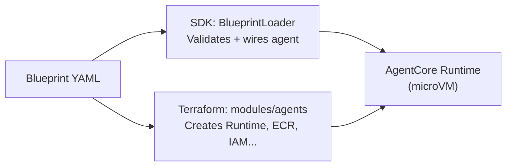

# Blueprints

Blueprints are the core configuration abstraction of the AWS Agent Platform. A blueprint is a YAML file that declares everything a resource needs -- its model, runtime behaviour, tools, memory, identity, observability, and access-control policy. The platform reads blueprint YAML at both SDK load time and Terraform plan time, driving code execution and infrastructure provisioning from a single source of truth.

---

## Blueprint Types

| Type | File Convention | Purpose | Terraform Consumer |
|------|-----------------|---------|-------------------|
| **Agent** | `blueprints/agents/*.yaml` | Declares a single AI agent: model, runtime, tools, memory, identity, observability, evaluation, policy | `modules/agents` |
| **Strategy** | `blueprints/strategies/*.yaml` | Declares an evaluation strategy: entry/exit conditions, parameters, evaluation criteria, risk controls | Domain-specific modules |
| **Workflow** | `blueprints/workflows/*.yaml` | Declares a multi-agent pipeline: DAG structure, agent references, parallel branches, retry logic | `modules/workflows` |

---

## How Blueprints Are Consumed

```
blueprints/
  agents/
    researcher.yaml     # one file per agent
    synthesizer.yaml
  strategies/
    primary.yaml
  workflows/
    analysis-pipeline.yaml
```

At **SDK load time**, `BlueprintLoader` reads YAML from disk, validates it against the Pydantic schema classes in `agent_core.schemas` and `agent_core.blueprints`, and returns a typed `AgentBlueprint` object that drives runtime wiring.

At **Terraform plan time**, the `modules/agents` and `modules/workflows` modules call `fileset()` and `yamldecode()` to read the same YAML files and create the corresponding AWS resources per blueprint entry.



---

## Blueprint Validation

The platform validates blueprints at load time using Pydantic v2. Invalid blueprints fail loudly -- there are no silent defaults or fallback paths. Use the CLI to validate individual blueprint files before deploying:

```bash
agentcli blueprint lint blueprints/agents/researcher.yaml
agentcli blueprint lint blueprints/workflows/analysis-pipeline.yaml
```

---

## Pages in This Section

| Page | Description |
|------|-------------|
| [Agent Blueprint](./agent-blueprint) | Full specification for agent blueprints -- all configurable blocks |
| [Strategy Blueprint](./strategy-blueprint) | Specification for strategy evaluation blueprints |
| [Workflow Blueprint](./workflow-blueprint) | Specification for multi-agent workflow blueprints |
