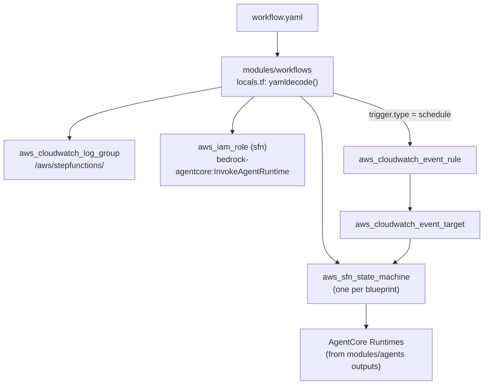

# Workflow Blueprint

A workflow blueprint declares a multi-agent pipeline as a YAML file. The `modules/workflows` Terraform module reads these files and generates AWS Step Functions state machines — one state machine per blueprint. Workflow blueprints support sequential agent steps, parallel branches, choice routing, retry/catch logic, and EventBridge triggers.

---

## Top-Level Identity Fields

```yaml
id: analysis-pipeline              # Unique workflow identifier (snake_case). Used as SFN name key.
name: Analysis Pipeline            # Human-readable name for dashboards
version: 1.0.0                     # Semantic version
description: |
  Runs data analysis agents in sequence, then synthesises results
  and routes to the appropriate downstream handler.
timeout_minutes: 60                # Overall workflow timeout. Default: 60.
```

---

## `trigger:` Block

Configures how the workflow is started. Two trigger types are supported: `schedule` (EventBridge rule) and `manual` (API call only).

```yaml
trigger:
  type: schedule                   # schedule | manual
  schedule: "cron(0 8 * * ? *)"   # EventBridge schedule expression
```

For scheduled workflows, the platform creates an `aws_cloudwatch_event_rule` and wires an `aws_cloudwatch_event_target` that injects `trigger`, `scheduled_time`, `workflow`, and `environment` into the execution input.

---

## `states:` Block

The `states:` list defines the workflow DAG. Each entry is either an agent invocation, a parallel branch, or a choice router.

### Sequential Agent Step

```yaml
states:
  - id: ResearchStep              # State name (PascalCase by convention)
    agent: researcher             # Agent ID — must match an agent blueprint id
    next: SynthesisStep           # Next state ID. Omit for terminal states.
    retry_max: 3                  # Max retry attempts on error. Default: 3.
    prompt: "$.input.query"       # JSONPath or static string for agent payload
```

The Terraform module resolves the agent's Runtime ARN from `var.agent_runtime_arns` (passed from `module.agents.runtime_arns`) and generates a Step Functions SDK integration task using `arn:aws:states:::aws-sdk:bedrockagentcore:invokeAgentRuntime`.

Results are written to `$.results.<agent_id>` in the execution state.

### Parallel Branch

Runs multiple agents simultaneously. All branches must complete before the workflow continues.

```yaml
states:
  - id: ParallelAnalysis
    parallel:
      - agent: analyst-a           # Each entry is an agent reference
      - agent: analyst-b
      - agent: analyst-c
    next: SynthesisStep
```

Parallel results are merged into `$.parallel_results`.

### Choice Router

Routes to different next states based on the execution context.

```yaml
states:
  - id: RouteByConfidence
    choice:
      - condition: "$.results.researcher.confidence >= 0.8"
        next: HighConfidenceHandler
      - condition: "$.results.researcher.confidence >= 0.5"
        next: MediumConfidenceHandler
      - default: LowConfidenceHandler    # Fallback if no condition matches
```

---

## `retry:` Block (per state)

Each agent step automatically includes retry logic. Override defaults per-state:

```yaml
states:
  - id: CriticalStep
    agent: critical-agent
    retry_max: 5                   # Max attempts (default: 3)
    retry_interval: 5              # Base interval in seconds (default: 2)
    retry_backoff: 1.5             # Backoff multiplier (default: 2.0)
    next: NextStep
```

On final failure, the step transitions to an auto-generated `<StateId>_Failed` Fail state, writing the error to `$.error.<agent_id>`.

---

## `memory_branching:` Block

Configures AgentCore Memory branching for multi-agent workflows. When enabled, each agent step can operate on an isolated memory branch, with merge happening at workflow completion.

```yaml
memory_branching:
  enabled: true
  merge_strategy: union            # union | intersection | coordinator_wins
  branch_namespace: "{sessionId}/branches/{stateId}"
```

---

## `execution_modes:` Block

Gates which execution environments the workflow runs in.

```yaml
execution_modes:
  simulation: true                 # Active in simulation environment
  staging: true                    # Active in staging
  production: false                # Disabled until promoted
```

---

## Complete Multi-Agent Pipeline Example

```yaml
id: research-synthesis-pipeline
name: Research and Synthesis Pipeline
version: 1.1.0
description: |
  Parallel data collection, followed by synthesis and
  confidence-based routing to a final output handler.
timeout_minutes: 45

trigger:
  type: manual                     # Triggered via API or Step Functions StartExecution

states:
  # Step 1: Validate the incoming request
  - id: ValidateRequest
    agent: validator
    next: ParallelCollection
    retry_max: 2
    prompt: "$.input"

  # Step 2: Run three collection agents in parallel
  - id: ParallelCollection
    parallel:
      - agent: web-researcher
      - agent: database-researcher
      - agent: archive-researcher
    next: SynthesisStep

  # Step 3: Synthesise parallel results
  - id: SynthesisStep
    agent: synthesizer
    next: RouteByConfidence
    retry_max: 3
    prompt: "$.parallel_results"

  # Step 4: Route based on synthesiser confidence
  - id: RouteByConfidence
    choice:
      - condition: "$.results.synthesizer.confidence >= 0.85"
        next: HighQualityOutput
      - condition: "$.results.synthesizer.confidence >= 0.55"
        next: ReviewRequired
      - default: LowQualityFallback

  # Step 5a: High-quality path
  - id: HighQualityOutput
    agent: output-formatter
    prompt: "$.results.synthesizer"

  # Step 5b: Requires human review
  - id: ReviewRequired
    agent: review-preparer
    prompt: "$.results.synthesizer"

  # Step 5c: Low-quality fallback
  - id: LowQualityFallback
    agent: fallback-handler
    prompt: "$.results.synthesizer"

memory_branching:
  enabled: true
  merge_strategy: coordinator_wins
  branch_namespace: "{sessionId}/pipeline/{stateId}"

execution_modes:
  simulation: true
  staging: true
  production: true
```

---

## How Workflows Map to Step Functions

The Terraform module translates the blueprint into an Amazon States Language (ASL) definition:



The module uses the AWS SDK integration pattern (`arn:aws:states:::aws-sdk:bedrockagentcore:invokeAgentRuntime`) because no optimised Step Functions integration exists for AgentCore at this time.

---

## Cross-Module Wiring

The workflows module receives agent Runtime ARNs from the agents module:

```hcl
module "workflows" {
  source = "git::https://github.com/your-org/aws-agent-platform.git//modules/workflows"

  workflow_dir       = "./blueprints/workflows"
  agent_runtime_arns = module.agents.runtime_arns  # Map of agent_id → Runtime ARN
  environment        = var.environment
  resource_prefix    = var.resource_prefix
  aws_region         = var.aws_region
  ssm_root_path      = var.ssm_root_path
}
```

See [Deployment Patterns](../infrastructure/deployment-patterns) for the full three-module composition.
