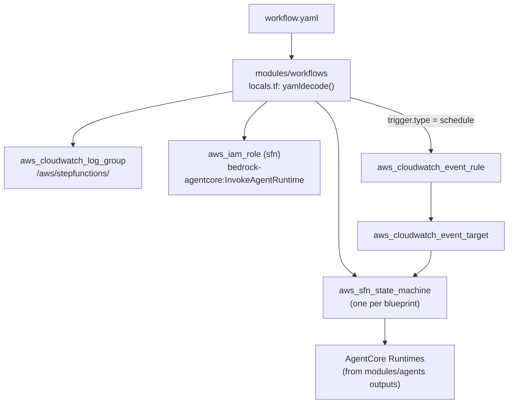

# Workflow Blueprint

A workflow blueprint declares a multi-agent pipeline as a YAML file. The `modules/workflows` Terraform module reads these files and generates AWS Step Functions state machines -- one state machine per blueprint. Workflow blueprints support sequential agent steps, parallel branches, choice routing, retry/catch logic, and EventBridge triggers.

---

## Top-Level Identity Fields

```yaml
id: analysis-pipeline              # Unique workflow identifier (snake_case). Used as SFN name key.
name: Analysis Pipeline            # Human-readable name for dashboards. Required.
version: "1.0.0"                   # Semantic version. Required.
description: |                     # Optional description.
  Runs data analysis agents in sequence, then synthesises results
  and routes to the appropriate downstream handler.
timeout_minutes: 60                # Overall workflow timeout. Default: 60. Must be > 0.
```

---

## `trigger:` Block

Configures how the workflow is started. Three trigger types are supported: `schedule` (EventBridge rule), `event` (EventBridge event pattern), and `manual` (API call only).

```yaml
# Schedule trigger — runs on a cron expression
trigger:
  type: schedule                   # schedule | event | manual
  schedule: "cron(0 8 * * ? *)"   # EventBridge schedule expression
  timezone: "UTC"                  # Optional IANA timezone
```

```yaml
# Event trigger — reacts to EventBridge event patterns
trigger:
  type: event
  event_pattern:
    source: ["my.application"]
    detail-type: ["DataReady"]
```

```yaml
# Manual trigger — API call or Step Functions StartExecution only
trigger:
  type: manual
```

For scheduled workflows, the platform creates an `aws_cloudwatch_event_rule` and wires an `aws_cloudwatch_event_target` that injects `trigger`, `scheduled_time`, `workflow`, and `environment` into the execution input.

---

## `states:` Block

The `states:` list defines the workflow DAG. Each entry is either an agent invocation, a parallel branch, a choice router, a wait state, or a fail state.

### Sequential Agent Step

```yaml
states:
  - id: ResearchStep              # State name (PascalCase by convention)
    type: task                    # task | choice | parallel | wait | wait_for_token | succeed | fail
    agent_ref: researcher         # Agent blueprint ID to invoke via AgentCore Runtime
    next: SynthesisStep           # Next state ID. Omit for terminal states.
    prompt: "$.input.query"       # JSONPath to the prompt field in execution input
    retry_max: 3                  # Maximum retry attempts for this state (>= 1)
    heartbeat_seconds: 30         # Heartbeat interval for callback-pattern wait states (> 0)
    input_mapping:                # Optional map of state input keys to agent payload keys
      query: "$.input.query"
      context: "$.results.previous"
```

The Terraform module resolves the agent's Runtime ARN from `var.agent_runtime_arns` (passed from `module.agents.runtime_arns`) and generates a Step Functions SDK integration task using `arn:aws:states:::aws-sdk:bedrockagentcore:invokeAgentRuntime`.

Results are written to `$.results.<agent_id>` in the execution state.

### Parallel Branch

Runs multiple agents simultaneously. All branches must complete before the workflow continues.

```yaml
states:
  - id: ParallelAnalysis
    type: parallel
    branches:                      # Each branch is a dict (sub-workflow definition)
      - states:
          - id: AnalystA
            agent_ref: analyst-a
      - states:
          - id: AnalystB
            agent_ref: analyst-b
    next: SynthesisStep
```

Parallel results are merged into `$.parallel_results`.

### Choice Router

Routes to different next states based on the execution context.

```yaml
states:
  - id: RouteByConfidence
    type: choice
    choices:
      - condition:
          path: "$.results.researcher.confidence"
          op: ">="
          value: 0.8
        next: HighConfidenceHandler
      - condition:
          path: "$.results.researcher.confidence"
          op: ">="
          value: 0.5
        next: MediumConfidenceHandler
    default: LowConfidenceHandler  # Fallback if no condition matches
```

### Fail State

Terminal state that records an error.

```yaml
states:
  - id: ValidationFailed
    type: fail
    error: "ValidationError"       # Error code
    cause: "Input did not pass validation checks"  # Error description
```

---

## `retry:` and `catch:` (per state)

Each agent step supports standard Step Functions retry and catch configuration:

```yaml
states:
  - id: CriticalStep
    type: task
    agent_ref: critical-agent
    prompt: "$.input"
    retry_max: 5                   # Shorthand for simple retry
    retry:                         # Full retry config (list of retry policies)
      - ErrorEquals: ["States.TaskFailed"]
        IntervalSeconds: 5
        MaxAttempts: 3
        BackoffRate: 2.0
    catch:                         # Catch config (list of catch policies)
      - ErrorEquals: ["States.ALL"]
        Next: ErrorHandler
    next: NextStep
```

---

## `memory_branching:` Block

Configures AgentCore Memory branching for multi-agent workflows. When enabled, each agent step operates on an isolated memory branch.

```yaml
memory_branching:
  enabled: true                    # Enable per-state memory branches (default: false)
  merge_strategy: union            # union | latest | coordinator_wins | none (default: union)
  branch_namespace: "{sessionId}/branches/{stateId}"  # Namespace template with {sessionId}, {stateId}
```

| Merge Strategy | Behaviour |
|----------------|-----------|
| `union` | Merge all branch memories into the main namespace |
| `latest` | Keep only the most recent branch's memories |
| `coordinator_wins` | Coordinator's memories take precedence on conflicts |
| `none` | No merge -- branches remain isolated |

---

## Complete Multi-Agent Pipeline Example

```yaml
id: research-synthesis-pipeline
name: Research and Synthesis Pipeline
version: "1.1.0"
description: |
  Parallel data collection, followed by synthesis and
  confidence-based routing to a final output handler.
timeout_minutes: 45

trigger:
  type: manual                     # Triggered via API or Step Functions StartExecution

states:
  # Step 1: Validate the incoming request
  - id: ValidateRequest
    type: task
    agent_ref: validator
    next: ParallelCollection
    retry_max: 2
    prompt: "$.input"

  # Step 2: Run three collection agents in parallel
  - id: ParallelCollection
    type: parallel
    branches:
      - states:
          - id: WebResearch
            agent_ref: web-researcher
            prompt: "$.input.query"
      - states:
          - id: DatabaseResearch
            agent_ref: database-researcher
            prompt: "$.input.query"
      - states:
          - id: ArchiveResearch
            agent_ref: archive-researcher
            prompt: "$.input.query"
    next: SynthesisStep

  # Step 3: Synthesise parallel results
  - id: SynthesisStep
    type: task
    agent_ref: synthesizer
    next: RouteByConfidence
    retry_max: 3
    prompt: "$.parallel_results"

  # Step 4: Route based on synthesiser confidence
  - id: RouteByConfidence
    type: choice
    choices:
      - condition:
          path: "$.results.synthesizer.confidence"
          op: ">="
          value: 0.85
        next: HighQualityOutput
      - condition:
          path: "$.results.synthesizer.confidence"
          op: ">="
          value: 0.55
        next: ReviewRequired
    default: LowQualityFallback

  # Step 5a: High-quality path
  - id: HighQualityOutput
    type: task
    agent_ref: output-formatter
    prompt: "$.results.synthesizer"

  # Step 5b: Requires human review
  - id: ReviewRequired
    type: task
    agent_ref: review-preparer
    prompt: "$.results.synthesizer"

  # Step 5c: Low-quality fallback
  - id: LowQualityFallback
    type: task
    agent_ref: fallback-handler
    prompt: "$.results.synthesizer"

memory_branching:
  enabled: true
  merge_strategy: coordinator_wins
  branch_namespace: "{sessionId}/pipeline/{stateId}"
```

---

## How Workflows Map to Step Functions

The Terraform module translates the blueprint into an Amazon States Language (ASL) definition:



The module uses the AWS SDK integration pattern (`arn:aws:states:::aws-sdk:bedrockagentcore:invokeAgentRuntime`) because no optimised Step Functions integration exists for AgentCore at this time.

---

## Cross-Module Wiring

The workflows module receives agent Runtime ARNs from the agents module:

```hcl
module "workflows" {
  source = "git::https://github.com/your-org/aws-agent-platform.git//modules/workflows"

  workflow_dir       = "./blueprints/workflows"
  agent_runtime_arns = module.agents.runtime_arns  # Map of agent_id -> Runtime ARN
  environment        = var.environment
  resource_prefix    = var.resource_prefix
  aws_region         = var.aws_region
  ssm_root_path      = var.ssm_root_path
}
```

See [Deployment Patterns](../infrastructure/deployment-patterns) for the full three-module composition.

---

## Schema Reference

| Field | Type | Required | Default | Description |
|-------|------|----------|---------|-------------|
| `id` | `str` | Yes | -- | Unique workflow identifier |
| `name` | `str` | Yes | -- | Human-readable name |
| `version` | `str` | Yes | -- | Semantic version |
| `description` | `str` | No | `""` | Workflow description |
| `trigger` | `TriggerConfig` | No | `schedule` | Trigger configuration |
| `trigger.type` | `str` | No | `schedule` | `schedule`, `event`, or `manual` |
| `trigger.schedule` | `str` | No | `null` | Cron expression |
| `trigger.timezone` | `str` | No | `null` | IANA timezone |
| `trigger.event_pattern` | `dict` | No | `null` | EventBridge event pattern |
| `timeout_minutes` | `int` | No | `60` | Overall workflow timeout |
| `states` | `list[WorkflowState]` | No | `[]` | State machine definition |
| `memory_branching` | `MemoryBranchConfig` | No | `null` | Memory branching config |
