# Workflow Blueprint

A workflow blueprint declares a multi-agent pipeline as a YAML file. The `modules/workflows` Terraform module reads these files and generates AWS Step Functions state machines — one state machine per blueprint. Workflow blueprints support sequential agent steps, parallel branches, choice routing, callback-pattern wait states, and EventBridge triggers.

**Required fields:** `id`, `version`, `name`. All other fields have safe defaults.

Workflow blueprint files live under `blueprints/workflows/*.yaml` in a domain repo.

---

## Top-Level Identity Fields

```yaml
id: research-synthesis-pipeline    # Unique workflow identifier. Kebab-case by convention.
name: Research and Synthesis       # Human-readable name for dashboards. Required.
version: "1.0.0"                   # Semantic version. Required.
description: |                     # Optional description.
  Parallel data collection followed by synthesis and
  confidence-based routing to the output handler.
timeout_minutes: 60                # Overall workflow timeout. Default: 60. Must be > 0.
```

---

## `trigger:` Block

Configures how the workflow is started. Three trigger types are supported.

```yaml
# Schedule trigger — runs on an EventBridge cron or rate expression.
trigger:
  type: schedule
  schedule: "cron(0 8 * * ? *)"   # EventBridge schedule expression.
  timezone: "UTC"                  # Optional IANA timezone.
```

```yaml
# Event trigger — reacts to an EventBridge event pattern.
trigger:
  type: event
  event_pattern:
    source: ["my.application"]
    detail-type: ["DataReady"]
```

```yaml
# Manual trigger — Step Functions StartExecution or API call only.
trigger:
  type: manual
```

For scheduled workflows, the platform creates an `aws_cloudwatch_event_rule` and wires an `aws_cloudwatch_event_target` that injects `trigger`, `scheduled_time`, `workflow`, and `environment` into the execution input.

---

## `states:` Block

The `states:` list defines the workflow DAG. Each entry is one of seven state types:

| Type | Description |
|------|-------------|
| `task` | Invokes an agent via AgentCore Runtime |
| `choice` | Routes to different states based on a condition |
| `parallel` | Runs multiple branches concurrently |
| `wait` | Pauses for a fixed duration |
| `wait_for_token` | Pauses until an external callback sends a task token (Step Functions callback pattern) |
| `succeed` | Terminal success state |
| `fail` | Terminal error state |

### Task State (Sequential Agent Step)

```yaml
states:
  - id: ResearchStep              # State name. PascalCase by convention.
    type: task
    agent_ref: researcher         # Agent blueprint ID. Resolved to Runtime ARN by Terraform.
    next: SynthesisStep           # Next state ID. Omit for terminal states.
    prompt: "$.input.query"       # JSONPath to the prompt field in execution input.
    retry_max: 3                  # Maximum retry attempts (>= 1). Shorthand for simple retry.
    input_mapping:                # Optional. Map state input keys to agent payload keys.
      query: "$.input.query"
      context: "$.results.previous"
```

Terraform resolves the agent's Runtime ARN from `var.agent_runtime_arns` (passed from `module.agents.runtime_arns`) and generates a Step Functions SDK integration task using `arn:aws:states:::aws-sdk:bedrockagentcore:invokeAgentRuntime`. Results are written to `$.results.<agent_id>` in the execution state.

### Parallel State

Runs multiple agents simultaneously. All branches must complete before the workflow continues. Results are merged into `$.parallel_results`.

```yaml
  - id: ParallelAnalysis
    type: parallel
    branches:
      - states:
          - id: AnalystA
            type: task
            agent_ref: analyst-a
            prompt: "$.input.query"
      - states:
          - id: AnalystB
            type: task
            agent_ref: analyst-b
            prompt: "$.input.query"
    next: SynthesisStep
```

### Choice State

Routes to different next states based on the execution context.

```yaml
  - id: RouteByConfidence
    type: choice
    choices:
      - condition:
          path: "$.results.researcher.confidence"
          op: ">="
          value: 0.8
        next: HighConfidenceHandler
      - condition:
          path: "$.results.researcher.confidence"
          op: ">="
          value: 0.5
        next: MediumConfidenceHandler
    default: LowConfidenceHandler  # Fallback if no condition matches.
```

### Succeed State

Terminal state that records explicit success.

```yaml
  - id: PipelineComplete
    type: succeed
```

### Fail State

Terminal state that records an error.

```yaml
  - id: ValidationFailed
    type: fail
    error: "ValidationError"
    cause: "Input did not pass validation checks."
```

### Wait for Token State (Callback Pattern)

Pauses the workflow until an external system calls `SendTaskSuccess` or `SendTaskFailure` with the task token. This implements the Step Functions [callback pattern](https://docs.aws.amazon.com/step-functions/latest/dg/connect-to-resource.html#connect-wait-token).

```yaml
  - id: AwaitHumanReview
    type: wait_for_token
    heartbeat_seconds: 3600        # Timeout if no heartbeat received within this interval.
    next: PostReviewStep
```

---

## `retry:` and `catch:` (per state)

Each task state supports standard Step Functions retry and catch policies alongside the `retry_max` shorthand:

```yaml
  - id: CriticalStep
    type: task
    agent_ref: critical-agent
    prompt: "$.input"
    retry:                         # Full retry config — list of retry policies.
      - ErrorEquals: ["States.TaskFailed"]
        IntervalSeconds: 5
        MaxAttempts: 3
        BackoffRate: 2.0
    catch:                         # Catch config — list of catch policies.
      - ErrorEquals: ["States.ALL"]
        Next: ErrorHandler
    next: NextStep
```

---

## `memory_branching:` Block

Configures AgentCore Memory branching for multi-agent workflows. When enabled, each agent step operates on an isolated memory branch.

```yaml
memory_branching:
  enabled: true                    # Enable per-state memory branches. Default: false.
  merge_strategy: union            # union | latest | coordinator_wins | none. Default: union.
  branch_namespace: "{sessionId}/branches/{stateId}"  # Namespace template.
```

| Merge Strategy | Behaviour |
|----------------|-----------|
| `union` | Merge all branch memories into the main namespace |
| `latest` | Keep only the most recent branch's memories |
| `coordinator_wins` | Coordinator's memories take precedence on conflicts |
| `none` | No merge — branches remain isolated |

---

## Complete Multi-Agent Pipeline Example

```yaml
id: research-synthesis-pipeline
name: Research and Synthesis Pipeline
version: "1.1.0"
description: |
  Parallel data collection, followed by synthesis and
  confidence-based routing to a final output handler.
timeout_minutes: 45

trigger:
  type: manual

states:
  # Step 1: Validate the incoming request.
  - id: ValidateRequest
    type: task
    agent_ref: validator
    next: ParallelCollection
    retry_max: 2
    prompt: "$.input"

  # Step 2: Run three collection agents in parallel.
  - id: ParallelCollection
    type: parallel
    branches:
      - states:
          - id: WebResearch
            type: task
            agent_ref: web-researcher
            prompt: "$.input.query"
      - states:
          - id: DatabaseResearch
            type: task
            agent_ref: database-researcher
            prompt: "$.input.query"
      - states:
          - id: ArchiveResearch
            type: task
            agent_ref: archive-researcher
            prompt: "$.input.query"
    next: SynthesisStep

  # Step 3: Synthesise parallel results.
  - id: SynthesisStep
    type: task
    agent_ref: synthesizer
    next: RouteByConfidence
    retry_max: 3
    prompt: "$.parallel_results"

  # Step 4: Route based on synthesiser confidence.
  - id: RouteByConfidence
    type: choice
    choices:
      - condition:
          path: "$.results.synthesizer.confidence"
          op: ">="
          value: 0.85
        next: HighQualityOutput
      - condition:
          path: "$.results.synthesizer.confidence"
          op: ">="
          value: 0.55
        next: ReviewRequired
    default: LowQualityFallback

  # Step 5a: High-quality path — store result and finish.
  - id: HighQualityOutput
    type: task
    agent_ref: output-formatter
    prompt: "$.results.synthesizer"
    next: PipelineComplete

  # Step 5b: Route to human review via callback pattern.
  - id: ReviewRequired
    type: wait_for_token
    heartbeat_seconds: 86400      # 24-hour review window.
    next: PostReviewStep

  - id: PostReviewStep
    type: task
    agent_ref: review-finalizer
    prompt: "$.results.synthesizer"
    next: PipelineComplete

  # Step 5c: Low-quality fallback.
  - id: LowQualityFallback
    type: task
    agent_ref: fallback-handler
    prompt: "$.results.synthesizer"
    next: PipelineComplete

  - id: PipelineComplete
    type: succeed

memory_branching:
  enabled: true
  merge_strategy: coordinator_wins
  branch_namespace: "{sessionId}/pipeline/{stateId}"
```

---

## How Workflows Map to Step Functions

The Terraform module translates the blueprint into an Amazon States Language (ASL) definition:

```mermaid
flowchart TD
    YAML["workflow.yaml"] --> TF["modules/workflows\nlocals.tf: yamldecode()"]
    TF --> SFN["aws_sfn_state_machine\n(one per blueprint)"]
    TF --> LogGroup["aws_cloudwatch_log_group\n/aws/stepfunctions/<id>"]
    TF --> IAM["aws_iam_role (sfn)\nbedrock-agentcore:InvokeAgentRuntime"]
    TF -->|"trigger.type = schedule"| EventRule["aws_cloudwatch_event_rule"]
    EventRule --> EventTarget["aws_cloudwatch_event_target"]
    EventTarget --> SFN
    SFN --> AgentRuntime["AgentCore Runtimes\n(from modules/agents outputs)"]
```



The module uses the AWS SDK integration pattern (`arn:aws:states:::aws-sdk:bedrockagentcore:invokeAgentRuntime`) because no native Step Functions optimised integration exists for AgentCore Runtime at this time.

---

## Cross-Module Wiring

The workflows module receives agent Runtime ARNs from the agents module:

```hcl
module "workflows" {
  source = "git::https://github.com/The-Cloud-Clockwork/tcc-aws-agent-platform.git//modules/workflows"

  workflow_dir       = "./blueprints/workflows"
  agent_runtime_arns = module.agents.runtime_arns  # map of agent_id -> Runtime ARN
  environment        = var.environment
  resource_prefix    = var.resource_prefix
  aws_region         = var.aws_region
  ssm_root_path      = var.ssm_root_path
}
```

See [Deployment Patterns](../infrastructure/deployment-patterns) for the full three-module composition.

---

## Schema Reference

| Field | Type | Required | Default | Description |
|-------|------|----------|---------|-------------|
| `id` | `str` | **Yes** | — | Unique workflow identifier (kebab-case recommended) |
| `name` | `str` | **Yes** | — | Human-readable display name |
| `version` | `str` | **Yes** | — | Semantic version string |
| `description` | `str` | No | `""` | Workflow description |
| `trigger` | `TriggerConfig` | No | type=schedule | Trigger configuration |
| `trigger.type` | `str` | No | `schedule` | `schedule` \| `event` \| `manual` |
| `trigger.schedule` | `str` | No | `null` | EventBridge cron or rate expression |
| `trigger.timezone` | `str` | No | `null` | IANA timezone for scheduled triggers |
| `trigger.event_pattern` | `dict` | No | `null` | EventBridge event pattern for event triggers |
| `timeout_minutes` | `int` | No | `60` | Overall workflow timeout. Must be `> 0`. |
| `states` | `list[WorkflowState]` | No | `[]` | State machine definition |
| `states[].id` | `str` | **Yes** | — | State name (unique within the workflow) |
| `states[].type` | `str` | No | `task` | `task` \| `choice` \| `parallel` \| `wait` \| `wait_for_token` \| `succeed` \| `fail` |
| `states[].agent_ref` | `str` | No | `null` | Agent blueprint ID (task states) |
| `states[].prompt` | `str` | No | `null` | JSONPath to prompt field in execution input |
| `states[].retry_max` | `int` | No | `null` | Maximum retry attempts shorthand (`>= 1`) |
| `states[].heartbeat_seconds` | `int` | No | `null` | Heartbeat timeout for `wait_for_token` (`> 0`) |
| `states[].next` | `str` | No | `null` | Next state ID |
| `states[].choices` | `list[ChoiceRule]` | No | `null` | Choice rules (choice states) |
| `states[].default` | `str` | No | `null` | Default state for unmatched choices |
| `states[].branches` | `list[dict]` | No | `null` | Sub-workflow definitions (parallel states) |
| `states[].retry` | `list[dict]` | No | `null` | Full Step Functions retry policy list |
| `states[].catch` | `list[dict]` | No | `null` | Step Functions catch policy list |
| `states[].error` | `str` | No | `null` | Error code (fail states) |
| `states[].cause` | `str` | No | `null` | Error description (fail states) |
| `memory_branching` | `MemoryBranchConfig` | No | `null` | Per-state memory branch isolation |
