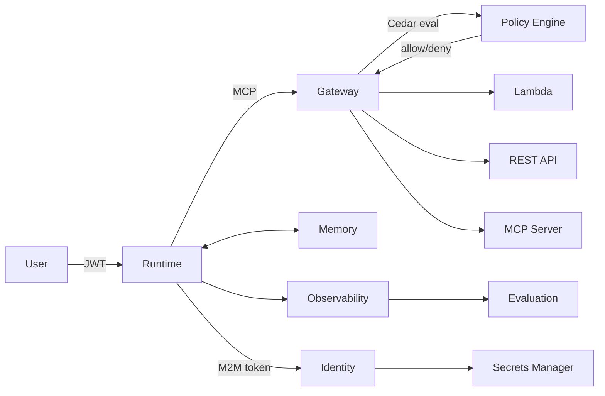

# Concepts

These pages explain the mental models, architectural reasoning, and design decisions behind each component of the AWS Agent Platform.

For API usage and code samples, see the [SDK Reference](../sdk/). These pages focus on understanding *why* things are designed the way they are — which makes the SDK easier to use correctly and the blueprints easier to write confidently.

Start with [Platform vs. Domain](concepts/platform-vs-domain) and [How It Works](concepts/how-it-works) to establish the foundational mental model. [The 12 Building Blocks](concepts/building-blocks) and [Blueprint Model](concepts/blueprint-model) build on that foundation.

---

## In This Section

| Page | What It Explains |
|------|-----------------|
| [Platform vs. Domain](concepts/platform-vs-domain) | The responsibility boundary between the platform and your domain repo — what each side owns, and how they fit together |
| [How It Works](concepts/how-it-works) | End-to-end flows: blueprint to running agent, request processing, memory persistence, identity delegation, and multi-agent coordination |
| [The 12 Building Blocks](concepts/building-blocks) | Each AgentCore concept in depth — Runtime, Gateway, Identity, Memory, Tools, Observability, Evaluation, Policy, Strands, A2A, IaC, and Blueprints |
| [Blueprint Model](concepts/blueprint-model) | The core abstraction: what a blueprint is, how YAML maps to a fully wired AWS agent, and why configuration-driven wiring matters |

---

## Per-Subsystem Deep Dives

Once you have the foundational mental model from the pages above, each topic section covers its subsystem in full detail — configuration reference, provider options, and operational guidance:

- [Inference Providers](../inference/) — Bedrock, LiteLLM, Anthropic, Vertex AI, and structured output enforcement
- [Observability & Evaluation](../observability/) — OTEL tracing, Langfuse, cost tracking, data protection, and LLM-as-judge evaluation
- [Identity, Policy & IAM](../policy/) — inbound JWT, outbound credentials, Cedar policy engine, and per-agent IAM roles
- [Tools, MCP & Gateway](../tools/) — built-in tools, MCP server base classes, and the AgentCore Gateway
- [Runtime & Memory](../runtime/) — AgentCore Runtime container lifecycle, short-term and long-term memory, A2A coordination, and the Prompt Registry
- [Infrastructure (Terraform)](../infrastructure/) — platform, agents, and workflows Terraform modules with full variable reference

---

## The Core Mental Model

The platform is built around one principle: **configuration drives everything**. You declare what an agent needs in YAML — its model, inference provider, tools, memory configuration, policy rules, observability settings — and the platform wires up the infrastructure automatically.

The SDK never hardcodes decisions that should vary by deployment. Models, inference providers, regions, sampling rates, tool endpoints — all come from blueprints or environment variables. The Concepts pages explain why this matters for each subsystem.

---

## How These Components Connect

Each component solves a distinct problem. The Concepts pages explain those problems first, then the solutions — so that when you write a blueprint, you understand what each block does and why it is designed the way it is.
