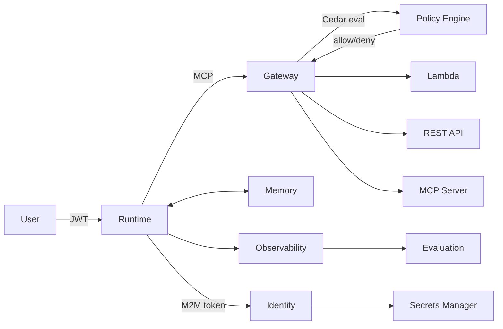

# Concepts

These pages explain the "why" behind each component of the AWS Agent Platform — the architectural reasoning, design decisions, and mental models that underpin the system.

For API usage and code samples, see the [SDK Reference](../sdk/). These pages focus on understanding *why* things are designed the way they are, which makes the SDK easier to use correctly.

---

## In This Section

| Page | What It Explains |
|------|-----------------|
| [Runtime](runtime) | What AgentCore Runtime really is (isolated microVMs), why not Lambda, the `/invocations` + `/ping` contract, and session lifecycle |
| [Gateway](gateway) | What problem Gateway solves, protocol translation (Lambda/REST/OpenAPI → MCP), the two auth layers, and why agents never know what's behind their tools |
| [Identity](identity) | The delegation model, four auth patterns (inbound JWT, outbound API keys, 3-legged OAuth, M2M), and how user tokens flow safely through agents |
| [Memory](memory) | Two tiers (short-term events vs long-term strategy extraction), namespacing, memory branching in multi-agent pipelines |
| [Observability](observability) | OTEL auto-instrumentation, CloudWatch GenAI metrics, Langfuse integration, data protection, and audit logging |
| [Evaluation](evaluation) | 13 built-in evaluators, LLM-as-judge pattern, on-demand vs online evaluation, how evaluation reads traces |
| [Policy](policy) | Why Cedar, the default DENY model, policy engine placement at the Gateway, common access control patterns |
| [A2A](a2a) | Agent-to-agent communication via agent cards, coordinator/specialist pattern, M2M auth flow, memory branching across agents |
| [Tools](tools) | Code Interpreter and Browser built-in tools — Gateway-mediated, sandbox lifecycle, tool discovery |
| [MCP](mcp) | Base classes for building MCP servers — BaseMCPServer, cache layer, provider routing, observability integration |
| [Prompts](prompts) | Prompt Registry — versioned prompt management, S3 + DynamoDB storage, mode-gated resolution, push/get/promote lifecycle |
| [Artifacts](artifacts) | Artifact Store — claim-check pattern, S3 + DynamoDB, signed URLs, 8 MCP tools, tiered storage |

---

## The Core Mental Model

The platform is built around one principle: **configuration drives everything**. You declare what an agent needs in YAML — its model, tools, memory configuration, policy rules, observability settings — and the platform wires up the infrastructure automatically.

This means the SDK never hardcodes decisions that should vary by deployment. Models, regions, sampling rates, tool endpoints — all come from blueprints or environment variables. The Concepts pages explain why this matters for each subsystem.

---

## How These Components Connect

Each component solves a different problem. The Concepts pages explain those problems first, then the solutions — so that when you configure a blueprint, you understand what each block does and why.
