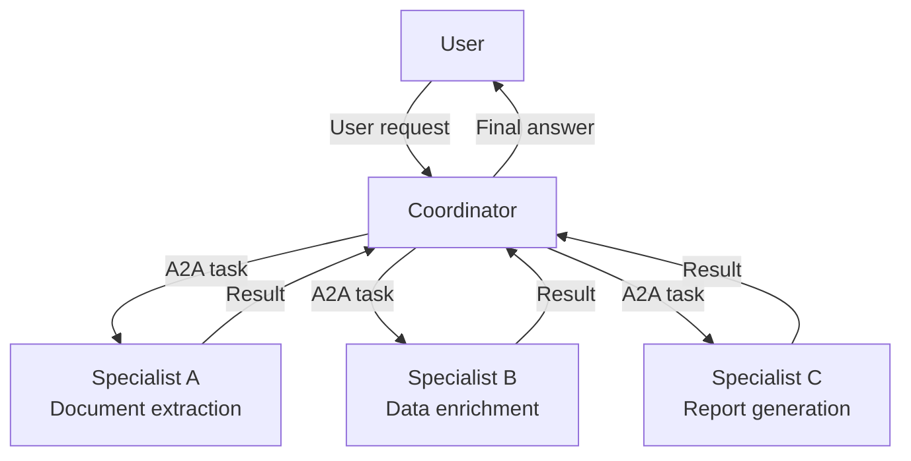
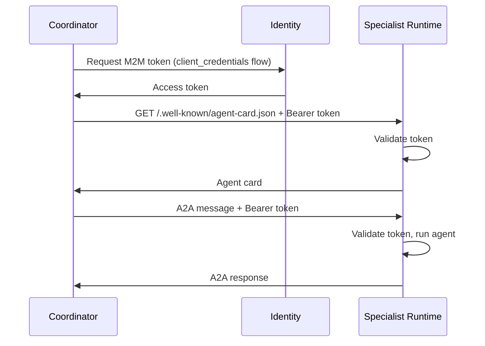

# Agent-to-Agent Communication

A2A (Agent-to-Agent) is a standardized protocol that lets agents discover each other, negotiate capabilities, and exchange structured messages — without hardcoded ARNs, without custom adapters, and across framework boundaries.

## Why A2A, Not Direct Invocation

You *can* call one agent from another using a direct API call:

```python
@tool
def call_specialist(query: str) -> str:
    client = boto3.client("bedrock-agentcore")
    response = client.invoke_agent_runtime(
        agentRuntimeArn="${SPECIALIST_ARN}",
        payload=json.dumps({"prompt": query}),
    )
    return parse_response(response)
```

This works but has significant limitations:

- **Hardcoded ARNs** — every coordinator must know every specialist's ARN at compile time
- **No capability negotiation** — you cannot discover what a specialist can do before calling it
- **Brittle** — if a specialist moves or changes its API, every caller breaks
- **No standardized message format** — each agent pair invents its own protocol
- **Framework lock-in** — a Strands coordinator cannot easily call an ADK specialist

A2A solves all of these by establishing a standard protocol layer: **agents publish what they can do, and coordinators discover and call them by capability, not by ARN.**

## Agent Cards

Every A2A-capable agent publishes an **agent card** at a well-known URL:

```
GET /.well-known/agent-card.json
```

On AgentCore Runtime, this endpoint is accessible at:

```
https://bedrock-agentcore.${AWS_REGION}.amazonaws.com/runtimes/{encoded_arn}/invocations/.well-known/agent-card.json
```

The agent card is a JSON document describing the agent's capabilities:

```json
{
  "name": "Document Extraction Specialist",
  "description": "Extracts structured data from documents",
  "version": "1.0.0",
  "url": "https://...",
  "capabilities": {
    "streaming": false,
    "push_notifications": false
  },
  "skills": [
    {
      "id": "extract_tables",
      "name": "Extract Tables",
      "description": "Extract tabular data from PDF or image documents"
    },
    {
      "id": "classify_document",
      "name": "Classify Document",
      "description": "Classify a document by type and subject matter"
    }
  ]
}
```

A coordinator reads this card to understand what the specialist can do before sending any messages.

## Port 9000 Convention

A2A servers run on port 9000, separate from the AgentCore Runtime's port 8080. This separation is intentional:

- Port 8080 — the `POST /invocations` contract for user-facing agent sessions
- Port 9000 — the A2A server for agent-to-agent communication

Both ports can be active simultaneously on the same Runtime container, served by different processes or the same process with multiple listeners.

## Coordinator / Specialist Pattern

The dominant A2A pattern is a coordinator agent that delegates subtasks to specialist agents:



The coordinator exposes a standard user-facing Runtime endpoint. Each specialist runs on its own Runtime. The coordinator discovers specialists by fetching their agent cards, then calls them as tools.

**Coordinator tool implementation:**

```python
@tool
async def extract_document(document_url: str) -> str:
    """Extract structured data from a document using the extraction specialist."""
    return await call_a2a_agent(
        agent_url="${EXTRACTION_SPECIALIST_URL}",
        message=f"Extract all tables from: {document_url}",
    )
```

The coordinator does not know the specialist's implementation. It only needs the URL and the agent card.

## M2M Authentication Flow

When agents communicate across Runtimes, they use machine-to-machine OAuth tokens. Each agent gets its own Cognito client credentials. The specialist's Runtime validates the coordinator's token before processing any A2A message.



In code, using the Identity `@requires_access_token` decorator:

```python
@requires_access_token(
    provider_name="specialist-agent-provider",
    scopes=[],
    auth_flow="M2M",
    into="bearer_token",
    force_authentication=True,
)
def build_a2a_client(bearer_token: str = "") -> httpx.AsyncClient:
    return httpx.AsyncClient(
        headers={
            "Authorization": f"Bearer {bearer_token}",
            "X-Amzn-Bedrock-AgentCore-Runtime-Session-Id": session_id,
        }
    )
```

Token refresh is automatic — the Identity service re-fetches before expiry.

## Memory Branching in Multi-Agent Pipelines

When multiple agents in a pipeline share a Memory resource, branching prevents context collision:

```python
from bedrock_agentcore.memory import MemorySessionManager

manager = MemorySessionManager(memory_id=memory_id)
session = manager.create_memory_session(actor_id, session_id)

# Coordinator writes to main branch
session.add_turns(messages, branch={"name": "main"})

# Each specialist writes to its own branch (forked from a coordinator event)
session.fork_conversation(
    root_event_id=coordinator_event_id,
    branch_name="extraction-specialist",
)

# Coordinator reads back from any specialist branch
specialist_context = session.get_last_k_turns(
    k=5,
    branch_name="extraction-specialist",
)
```

This pattern lets the coordinator see everything each specialist produced, while specialists see only their own context — no accidental contamination between specialist workstreams.

## Setting Up an A2A Server

To make an agent A2A-callable, wrap it in an `A2AServer`:

```python
from strands import Agent
from strands.multiagent.a2a import A2AServer

agent = Agent(
    model=model,
    tools=[extract_tables, classify_document],
    system_prompt="You are a document extraction specialist...",
)

a2a_server = A2AServer(
    agent=agent,
    http_url="http://0.0.0.0:9000/",
    serve_at_root=True,  # Required for AgentCore deployment
)

# Mount as a FastAPI app
app = a2a_server.to_fastapi_app()
uvicorn.run(app, host="0.0.0.0", port=9000)
```

The server automatically publishes `/.well-known/agent-card.json` and accepts A2A messages at the standard A2A endpoints.

## Calling Another Agent via A2A

```python
from a2a.client import A2ACardResolver, ClientConfig, ClientFactory

async def call_specialist(message: str, agent_url: str, token: str) -> str:
    async with httpx.AsyncClient(headers={"Authorization": f"Bearer {token}"}) as http:
        # 1. Discover the agent
        resolver = A2ACardResolver(httpx_client=http, base_url=agent_url)
        agent_card = await resolver.get_agent_card()

        # 2. Build a client from the card
        client = ClientFactory(ClientConfig(httpx_client=http)).create(agent_card)

        # 3. Send a message
        async for event in client.send_message(create_a2a_message(message)):
            if hasattr(event, "result") and event.result.artifacts:
                return event.result.artifacts[0].parts[0].text
    return ""
```

## Cross-Framework Interoperability

A2A is a protocol standard — not tied to Strands. A Strands coordinator can talk to an ADK specialist, a LangGraph coordinator can call a Strands specialist, or any agent that implements the A2A protocol on port 9000. The protocol handles capability negotiation, message format, and response artifacts.

This matters for organizations that use multiple agent frameworks or need to integrate with third-party agent services.

## See Also

- [A2A SDK Reference](../sdk/) — `A2AServerWrapper`, `A2AClient`, `A2AWiring`
- [Identity Concepts](identity) — M2M token pattern for inter-agent auth
- [Memory Concepts](memory) — memory branching in multi-agent pipelines
