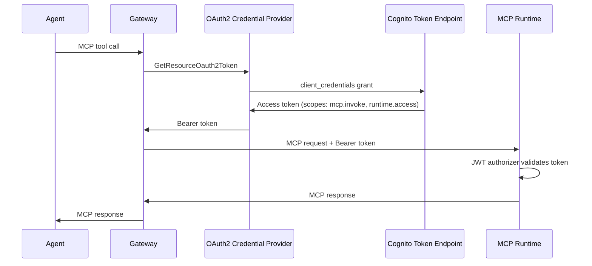
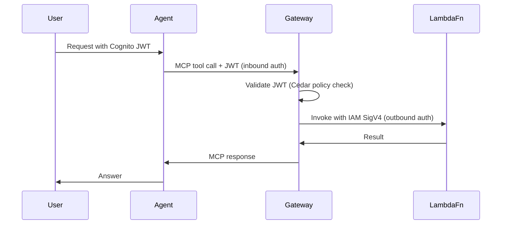

# The Universal Tool Bridge

AgentCore Gateway is a managed protocol translator that makes any backend — Lambda functions, REST APIs, OpenAPI services, or other MCP servers — accessible to agents through a single MCP interface.

## The Problem Gateway Solves

Agents need tools. Tools live in many different places: Lambda functions, internal REST APIs, third-party OpenAPI services, other agent runtime MCP servers. Without Gateway, every agent needs custom adapter code for each backend. As the number of tools and agents grows, this becomes a maintenance burden and a security risk (every agent managing its own credentials to every backend).

Gateway eliminates this by acting as a **central hub**: every backend registers with Gateway once, and every agent connects to Gateway once. The agent speaks MCP to Gateway; Gateway speaks whatever the backend needs.

The key insight is that Gateway is not just an API proxy — it is a **protocol translator**. It generates typed MCP tool schemas from Lambda invocation specs, OpenAPI documents, or explicit inline definitions. Your agents never know what's behind a tool.

## Where Gateway Sits

```
                        ┌─────────────────────────┐
                        │   AgentCore Gateway      │
                        │   (single MCP endpoint)  │
                        │                          │
Agent ── MCP ──────────>│  Lambda Target     ──────│──── IAM Role ──── Lambda fn
                        │  REST Target       ──────│──── HTTP ─────── REST API
                        │  OpenAPI Target    ──────│──── HTTP ─────── OpenAPI service
                        │  MCP Target        ──────│──── MCP ──────── Runtime MCP server
                        └─────────────────────────┘
```

The agent connects to one URL. Gateway routes tool calls to the appropriate backend, handles auth for each target, and returns results in MCP format.

## Two Auth Layers

Gateway enforces authentication at two independent points:

**Inbound auth — who can call the Gateway**

Two options:

- `AWS_IAM` — callers sign requests with SigV4. Agents running on Runtime with the correct IAM role just work.
- `CUSTOM_JWT` — callers present a JWT (typically from Cognito). This is how end-user identity flows: the user's Cognito token passes from the frontend, through the agent, to the Gateway. The Gateway validates it before routing any tool call.

**Outbound auth — how Gateway authenticates to its targets**

Each target type uses a different credential strategy:

| Target Type | Credential Method | How It Works |
|-------------|-------------------|--------------|
| Lambda | `GATEWAY_IAM_ROLE` | Gateway assumes its IAM role and signs the invocation with SigV4. No token exchange. |
| MCP Server (Runtime) | `OAUTH` | Gateway retrieves an M2M access token from an OAuth2 credential provider and injects it as a Bearer token. |
| OpenAPI | `API_KEY` or `OAUTH` | Gateway resolves the credential from Secrets Manager (API key) or an OAuth2 provider (M2M token). |

This separation is architecturally important. An end-user authenticates with their Cognito JWT (inbound), but the actual tool calls are made using the Gateway's own credentials (outbound). **The user's identity flows as context for policy evaluation — not as credentials for tool access.** This is the delegation model, not impersonation.

### M2M Token Flow for MCP Server Targets

When Gateway invokes an MCP server target that requires OAuth, it uses the `client_credentials` grant to obtain an M2M access token. The platform provisions a Cognito Resource Server with custom scopes (e.g., `mcp.invoke`, `runtime.access`) and a confidential M2M client. Gateway calls `GetResourceOauth2Token` on the credential provider, which handles the token exchange with the Cognito token endpoint. The resulting Bearer token is injected into the request to the MCP Runtime. On the receiving side, the Runtime validates the token using a JWT authorizer configured with the Cognito OIDC discovery URL.



For Lambda targets, the flow remains simpler — no token exchange is needed:



## Protocol Translation — Lambda to MCP

When you register a Lambda function as a Gateway target, you provide the tool schema inline. Gateway maps each tool name to a Lambda invocation:

```yaml
gateway:
  endpoint: "https://${GATEWAY_ID}.gateway.bedrock-agentcore.${AWS_REGION}.amazonaws.com"
  targets:
    - id: order-tools
      type: LAMBDA
      lambda_arn: "arn:aws:lambda:${AWS_REGION}:${AWS_ACCOUNT_ID}:function:order-handler"
      tools:
        - name: get_order
          description: "Get order details by ID"
          input_schema:
            type: object
            properties:
              orderId: {type: string}
            required: [orderId]
        - name: process_refund
          description: "Process a refund for an order"
          input_schema:
            type: object
            properties:
              orderId: {type: string}
              reason: {type: string}
            required: [orderId, reason]
```

When the agent calls `get_order(orderId="123")`, the chain is:

```
Strands agent → MCPClient → Gateway → Lambda(event={"orderId": "123"}) → response
```

The agent has no idea it is calling Lambda. It sees `get_order` as a regular MCP tool.

## Protocol Translation — REST and OpenAPI

For REST APIs, Gateway maps tool calls to HTTP requests. For OpenAPI services, Gateway derives tool schemas automatically from the spec — no manual schema definition required.

```yaml
targets:
  - id: analytics-api
    type: REST
    endpoint: "https://analytics.internal/api/v1"
    auth:
      type: api_key
      secret_arn: "arn:aws:secretsmanager:${AWS_REGION}:${AWS_ACCOUNT_ID}:secret:analytics-api-key"
```

## Consuming Gateway Tools in an Agent

The `GatewayClient` from `agent-core` produces a Strands-compatible `MCPClient` that the agent uses directly:

```python
from agent_core.gateway import GatewayClient
from strands import Agent

client = GatewayClient.from_blueprint("agent.yaml")
mcp_client = client.as_mcp_client()

with mcp_client:
    gateway_tools = mcp_client.list_tools_sync()
    agent = Agent(model=model, tools=[local_tool] + gateway_tools)
```

All tools from all registered targets are exposed through this single client. The agent mixes local tools and remote Gateway tools without distinction.

## Tool Discovery

`ToolDiscovery` enables semantic search across all registered targets. Useful when an agent has many tools and needs to dynamically select the relevant ones for a given task:

```python
from agent_core.gateway import ToolDiscovery

discovery = ToolDiscovery(client)
tools = await discovery.search("summarize documents and extract key findings")
# Returns ranked tool descriptors from any target
```

## Policy Engine Integration

Gateway has a built-in hook for attaching a Cedar policy engine. When attached, **every tool call goes through policy evaluation before reaching the backend**. The default mode is DENY — an empty engine blocks all tool calls. See the [Policy Concepts](policy) page for the full model.

## Why Agents Never Know What's Behind Their Tools

This design choice is intentional. Decoupling agents from tool implementations means:

- Backend infrastructure can change (Lambda → REST → new service) without modifying agent code
- Credentials stay in one place (Secrets Manager, resolved by Gateway), not scattered across agent codebases
- Policy enforcement happens centrally at Gateway, not per-agent
- Tool discovery works across all backends uniformly

An agent that knows it is calling a Lambda function is fragile. An agent that calls MCP tools through Gateway is resilient.

## See Also

- [Gateway SDK Reference](../sdk/gateway) — `GatewayClient`, `TargetRegistry`, `ToolDiscovery`
- [Identity Concepts](identity) — how user tokens flow through inbound/outbound auth
- [Policy Concepts](policy) — Cedar policy engine attached to Gateway
