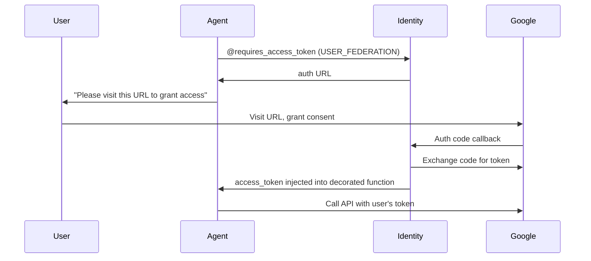
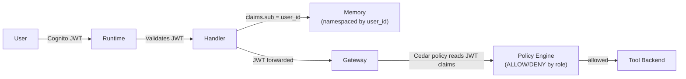

# How Auth Flows Through the System

AgentCore Identity manages authentication at every boundary in the platform: inbound (who can call your agent), outbound (what credentials your agent needs), and between agents (machine-to-machine tokens). The underlying model is **delegation**, not impersonation.

## The Delegation Model

Agents authenticate as themselves while carrying verifiable user context. An agent never pretends to be the user — it proves that the user authorized it to act, and each downstream service decides what the agent can do on that user's behalf.

This distinction matters because agents are autonomous. A single user request can trigger dozens of tool calls, branching decisions, and sub-agent delegations. At each step, you need to know both *who the user is* (for authorization) and *that the agent is legitimately acting for them* (for audit and trust).

## Four Auth Patterns

### Pattern 1: Inbound JWT Validation

**Problem:** Protect your agent from unauthorized callers.

AgentCore Runtime validates inbound tokens before your code runs. Configure in the blueprint:

```yaml
identity:
  authorizer:
    type: cognito_jwt
    user_pool_id: ${COGNITO_USER_POOL_ID}
    client_id: ${COGNITO_CLIENT_ID}
```

Or with a custom OIDC provider:

```yaml
identity:
  authorizer:
    type: custom_jwt
    discovery_url: ${OIDC_DISCOVERY_URL}
    allowed_clients:
      - ${CLIENT_ID}
```

Invalid tokens are rejected before your entrypoint fires. Inside the handler, the token has already been validated — you decode it to extract user identity without re-verifying the signature:

```python
@app.entrypoint
async def handle(context):
    token = context.request_headers.get("authorization", "").replace("Bearer ", "")
    claims = jwt.decode(token, options={"verify_signature": False})
    user_id = claims.get("sub")
    # user_id is the authenticated user — safe to use for memory scoping, policy context, etc.
```

### Pattern 2: Outbound API Key Injection

**Problem:** Your agent needs a third-party API key (e.g., a search service, a data API). You do not want the key in your codebase, container image, or environment variables.

Identity stores the key in Secrets Manager and injects it at runtime via a decorator:

```python
from bedrock_agentcore.identity.auth import requires_api_key

@requires_api_key(provider_name="search-api-key-provider")
async def init_search_client(*, api_key: str):
    os.environ["SEARCH_API_KEY"] = api_key  # Injected by Identity at runtime
```

The key never touches your code. It is fetched from Secrets Manager by the Identity service and injected into the decorated function at call time.

### Pattern 3: Three-Legged OAuth (User Consent)

**Problem:** Your agent needs to access a resource that belongs to the user — their calendar, their GitHub repos, their cloud storage. This requires the user's OAuth consent, not just the agent's credentials.



The flow in code:

```python
@tool(name="Get_calendar_events")
async def get_calendar():
    @requires_access_token(
        provider_name="google-cal-provider",
        scopes=["https://www.googleapis.com/auth/calendar.readonly"],
        auth_flow="USER_FEDERATION",
        on_auth_url=lambda url: print(f"Please visit: {url}"),
        callback_url="${CALLBACK_URL}",
    )
    async def get_events(access_token: str = "") -> str:
        # access_token is the user's Google OAuth token
        ...
    return await get_events()
```

The nested function pattern is intentional — `@requires_access_token` wraps the inner function so the Strands tool schema derivation does not expose `access_token` as a parameter the LLM can set.

### Pattern 4: Machine-to-Machine (Agent-to-Agent)

**Problem:** One agent needs to call another agent. No user consent is involved — this is service-to-service.

```python
@requires_access_token(
    provider_name="specialist-agent-provider",
    scopes=[],
    auth_flow="M2M",
    into="bearer_token",
    force_authentication=True,
)
def create_agent_client(bearer_token: str = "") -> httpx.AsyncClient:
    return httpx.AsyncClient(headers={
        "Authorization": f"Bearer {bearer_token}",
        "X-Amzn-Bedrock-AgentCore-Runtime-Session-Id": session_id,
    })
```

Each agent gets its own Cognito client credentials. The Identity service handles token refresh automatically.

## Auth Pattern Summary

| Pattern | Auth Flow | When to Use |
|---------|----------|-------------|
| Inbound JWT | Cognito or OIDC | Protect your agent from unauthorized callers |
| API key injection | Secrets Manager | Agent needs a static third-party credential |
| 3-legged OAuth | USER_FEDERATION | Agent needs user's permission to access their resources |
| M2M token | M2M | Agent-to-agent calls, no user consent needed |

## How User Identity Flows Through the Stack



The user's JWT is validated once at the Runtime boundary. Inside the system:

- Memory uses `user_id` from the claims for namespace scoping
- Gateway passes the JWT to the Policy Engine, which reads claims (e.g., group memberships) to make allow/deny decisions
- Tool backends never see the user's token — they receive calls from the Gateway's own IAM role

## Credential Lifecycle

Credentials managed by Identity are never in your container image or environment:

1. One-time setup: store credentials via Identity API (they land in Secrets Manager)
2. At runtime: Identity fetches from Secrets Manager and injects via decorators
3. Rotation: update in Secrets Manager — agents pick up the new credential on the next injection call

## See Also

- [Identity SDK Reference](../sdk/) — `IdentityProvider`, `IdentityClient`, `CredentialCache`
- [Gateway Concepts](gateway) — inbound/outbound auth layers at the Gateway boundary
- [A2A Concepts](a2a) — M2M auth in multi-agent pipelines
