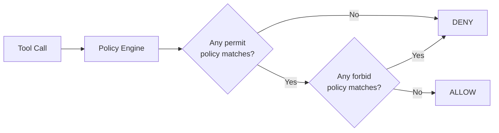

# Fine-Grained Access Control

AgentCore Policy inserts a Cedar policy engine between the Gateway and its tool targets, enforcing fine-grained access control on every tool call before it reaches any backend.

## Why Cedar, Not RBAC

Role-based access control (RBAC) answers "can this user call this tool?" Cedar answers "can this user call this tool *with these parameters* right now?" That distinction is critical for agents.

Agents make autonomous decisions about which tools to call and with what parameters. A blunt RBAC check ("role=analyst can call process_request") cannot prevent an analyst from calling `process_request(amount=10000000)`. Cedar evaluates the actual input parameters as part of the policy decision.

Cedar is also:

- **Default DENY** — an empty engine blocks everything. You explicitly permit what is allowed.
- **Composable** — multiple policies combine with standard permit/forbid semantics
- **Auditable** — every decision is loggable with the full context (principal, action, resource, input)

## Where Policy Sits

```
Agent → Gateway → Policy Engine (Cedar) → ALLOW/DENY → Target backend
```

The policy engine attaches to the Gateway, not the Runtime. This means:

- All agents using the same Gateway share the same policy engine
- Your agent code does not need to know about policies — it calls tools normally
- Policy enforcement is centralized and consistent across all callers
- Policy decisions are based on the **end-user's JWT claims**, not the agent's identity

The agent carries the user's JWT when calling the Gateway. Cedar reads the claims from that token (user ID, groups, scopes) to make the allow/deny decision.

## The Default DENY Model



An empty policy engine denies all tool calls. You must write explicit `permit` statements for every tool and user combination you want to allow. This is the safest default: if a new tool is added to the Gateway and no policy covers it, it is unreachable until a policy is written.

## Two Enforcement Modes

| Mode | Effect |
|------|--------|
| `ENFORCE` | Unauthorized calls are blocked. The agent receives an authorization error. |
| `LOG_ONLY` | All calls proceed. Unauthorized decisions are logged but not blocked. |

Use `LOG_ONLY` when rolling out a new policy engine to see what would be blocked before enforcing it.

```yaml
policy:
  engine: cedar
  mode: ENFORCE   # or LOG_ONLY
```

## Cedar Policy Patterns

Cedar policies follow the form: `permit/forbid (principal, action, resource) [when/unless condition]`

In AgentCore, actions are tool names and resources are Gateway ARNs.

### Allow all users to call a tool

```cedar
permit(
  principal,
  action == AgentCore::Action::"DataTarget___search_records",
  resource == AgentCore::Gateway::"<gateway_arn>"
);
```

### Restrict by input parameter value

```cedar
permit(
  principal,
  action == AgentCore::Action::"DataTarget___search_records",
  resource == AgentCore::Gateway::"<gateway_arn>")
when { context.input.limit <= 100 };
```

Users can search, but only with a result limit of 100 or fewer.

### Restrict by user group (from JWT claims)

```cedar
forbid(
  principal,
  action == AgentCore::Action::"ApprovalTarget___approve_request",
  resource == AgentCore::Gateway::"<gateway_arn>")
unless {
  principal has scope &&
  principal.scope.contains("group:Managers")
};
```

Only users with the `group:Managers` scope in their JWT can call `approve_request`.

### Combine parameter and role checks

```cedar
permit(
  principal,
  action == AgentCore::Action::"OrderTarget___process_order",
  resource == AgentCore::Gateway::"<gateway_arn>")
when {
  context.input.amount <= 500 ||
  (principal has scope && principal.scope.contains("group:SeniorStaff"))
};
```

Any user can process orders up to $500. Senior staff can process any amount.

## Declaring Policies in Blueprints

The `policy:` block in a blueprint defines rules that `agentcli policy generate` translates to Cedar:

```yaml
policy:
  engine: cedar
  mode: ENFORCE
  target_prefix: DataTarget
  rules:
    - name: limit-search-results
      when: "context.input.limit <= 100"
      actions:
        - search_records

    - name: admin-only-delete
      unless: "principal has scope && principal.scope.contains(\"group:Admins\")"
      actions:
        - delete_record
        - bulk_delete
```

Generate and inspect the Cedar before deploying:

```bash
agentcli policy lint agents/my-agent.yaml
agentcli policy generate agents/my-agent.yaml \
  --gateway-arn arn:aws:... \
  --output policies/my-agent.cedar
```

## NL-to-Cedar Translation

For teams unfamiliar with Cedar syntax, the Policy SDK supports natural language policy generation:

```python
from agent_core.policy.client import PolicyClient

client = PolicyClient(region="${AWS_REGION}")
result = client.generate_policy(
    policy_engine_id=engine_id,
    name="auto_policy",
    resource={"arn": gateway_arn},
    content={
        "rawText": "Allow users to search records only when the limit is 100 or fewer"
    },
    fetch_assets=True,  # Fetches tool schemas from Gateway for context
)
# result contains valid Cedar
```

The generated Cedar should be reviewed before being added to the engine. NL-to-Cedar is a starting point, not a replacement for human review of access control decisions.

## How Policies Compose

Multiple policies are evaluated together using Cedar semantics:

- If **any** `permit` matches and **no** `forbid` matches → ALLOW
- If **any** `forbid` matches → DENY (overrides permits)
- If **no** `permit` matches → DENY (default)

This means `forbid` rules are absolute overrides. Use them for safety rails (e.g., "never allow calls with PII in parameters") that must hold regardless of other permits.

## See Also

- [agentcli policy](../cli/policy) — CLI reference for policy lint and generate
- [Gateway Concepts](gateway) — where the policy engine attaches in the architecture
- [Policy SDK Reference](../sdk/) — `PolicyClient`, `CedarPolicyBuilder`, `PolicyTranslator`
