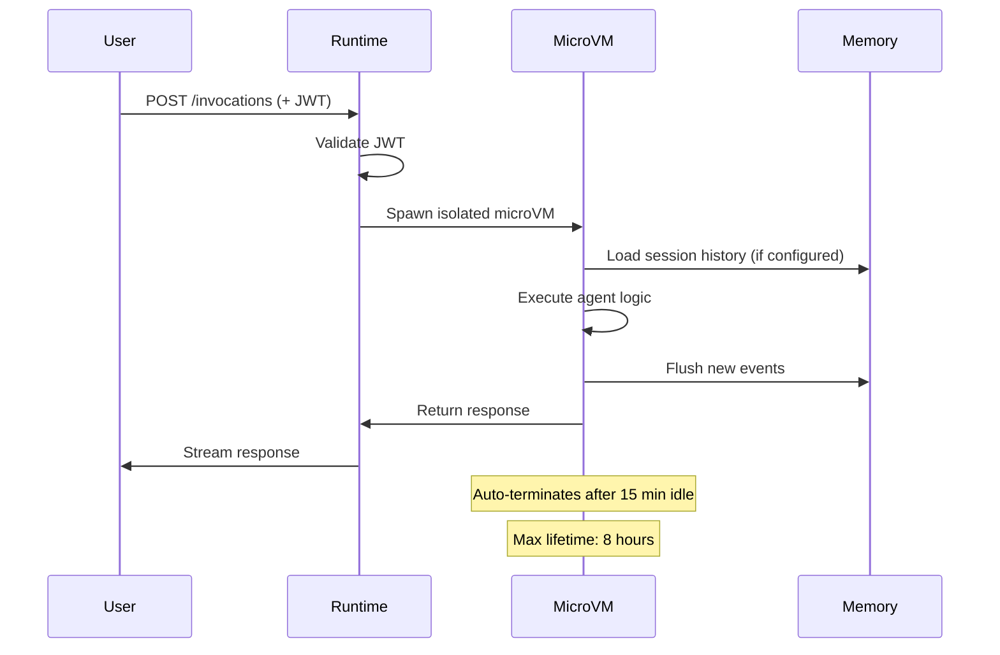

# What Is AgentCore Runtime?

AgentCore Runtime is a managed compute layer that runs each agent session inside an **isolated microVM** — giving you per-session process isolation, auto-scaling, and built-in auth, all from a single container image.

## The Core Idea

When you deploy an agent to AgentCore Runtime, you're not deploying to a server or a Lambda function. You're deploying a container image that AgentCore uses to spawn isolated microVMs on demand. Each user session gets its own microVM with isolated CPU, memory, and filesystem. Sessions are ephemeral — when a session ends, the microVM is destroyed and its state is gone (which is why [Memory](memory) exists as a separate service).

The Runtime contract is deliberately minimal: your container exposes two HTTP endpoints, and AgentCore handles everything else.

## The `/invocations` + `/ping` Contract

Every AgentCore Runtime container must expose exactly two endpoints:

- `POST /invocations` — receives the agent payload and returns the response
- `GET /ping` — returns `200 OK` when the container is healthy

AgentCore routes inbound sessions to `/invocations`, health-checks containers via `/ping`, and manages all the infrastructure around these endpoints: TLS termination, IAM/JWT auth validation, session routing, scaling, and microVM lifecycle.

The `AgentCoreApp` class from `agent-core` registers both endpoints automatically. You only write the handler logic:

```python
from agent_core.runtime import AgentCoreApp

app = AgentCoreApp.from_blueprint("agent.yaml")

@app.entrypoint
async def handle(context):
    session = context.session
    return await session.agent.invoke(payload.get("prompt"))
```

> **Note:** The platform vision is for `BlueprintLoader` to generate this entrypoint entirely from YAML — the `@app.entrypoint` handler shown above is what happens *under the hood*. In practice, domain developers write a 5-line `app.py` that delegates to `GenericHandler`, and the platform wires everything from the blueprint. The manual entrypoint approach is still valid for advanced use cases where you need full control.

### Alternative: Raw FastAPI (No SDK)

You do not need the `agent-core` SDK to deploy on AgentCore Runtime. The contract is just `POST /invocations` + `GET /ping` on port 8080. A raw FastAPI application works identically:

```python
from fastapi import FastAPI
from fastapi.responses import StreamingResponse

app = FastAPI()

@app.post("/invocations")
async def invoke(request):
    return StreamingResponse(...)

@app.get("/ping")
async def ping():
    return {"status": "healthy"}

# uvicorn.run(app, host="0.0.0.0", port=8080)
```

Both approaches deploy identically to AgentCore Runtime. The SDK is a convenience that wires blueprints, memory hooks, identity decorators, and observability automatically — but it is not a requirement.

For full SDK details, see the [Runtime SDK Reference](../sdk/runtime).

## Why Not Lambda?

Lambda appears throughout the platform — as Gateway targets, infrastructure utilities, OAuth handlers — but **never** as a deployment target for agents themselves. The reason is architectural.

Agents are:

- **Stateful** — a single invocation makes multiple LLM calls in a tool-use loop, accumulates conversation state, and may maintain a browser session
- **Long-running** — a complex agent task can stream responses for 30+ seconds and iterate through 5–20 tool-call rounds
- **Session-oriented** — multi-turn conversations require that the same "agent instance" persists across turns within a session

Lambda is designed for the opposite: short, stateless, fast functions. It's perfect for the tools that agents *call*, not for the agents themselves.

```
Agent (microVM)            Gateway            Lambda function
Long-running       -->   (MCP proxy)   -->   Short, stateless
Stateful                                     < 30 seconds
Streaming                                    Returns data
```

This is the fundamental split: **agents live on Runtime, tools live on Lambda, Gateway bridges them.**

## Session Lifecycle



Key lifecycle facts:

- Sessions auto-terminate after **15 minutes of idle time** (configurable)
- Maximum session lifetime is **8 hours**
- Idle pricing continues until you call `stop_runtime_session()` — design workflows to terminate sessions when done
- Warm container pools provide sub-second cold starts after the first invocation

## Deployment Flow

```
Your agent code
    |
    ▼
Docker image (python:3.12-slim base)
    |
    ▼
ECR repository (auto-created by agentcli deploy)
    |
    ▼
AgentCore Runtime (create_agent_runtime() call)
    |
    ▼
Per-session microVMs spawned on demand
```

The `agentcli deploy agent` command executes this entire flow from a blueprint YAML. See the [Deploy CLI reference](../cli/deploy).

## Auth — Zero Code Required

Runtime handles inbound authentication before your code runs. Configure the auth method in your blueprint:

```yaml
identity:
  authorizer:
    type: cognito_jwt
    user_pool_id: ${COGNITO_USER_POOL_ID}
    client_id: ${COGNITO_CLIENT_ID}
```

With this configured, invalid or missing tokens receive `AccessDeniedException` — your entrypoint handler is never invoked. Inside the handler, the token has already been validated; you can decode it to extract user identity without re-verifying the signature.

## Runtime Constraints

| Constraint | Value |
|-----------|-------|
| Idle timeout | 15 minutes (configurable) |
| Maximum session lifetime | 8 hours |
| Architecture | ARM64 (Graviton) only |
| Network modes | `PUBLIC` or `PRIVATE` (VPC) |
| Port | 8080 (for `/invocations` and `/ping`) |
| A2A port | 9000 |
| SSH / direct debugging | Not available |
| Pricing | Per-session-second (idle time is billed until `stop_runtime_session()`) |

ARM64 only means your Docker base image and all native dependencies must support Graviton. Use `python:3.12-slim` (multi-arch) as your base — it works out of the box.

> **Cost note:** Pricing is per-session-second. Long-running idle sessions can be expensive if you forget to call `stop_runtime_session()`. Design workflows to terminate sessions when their work is done.

## Streaming Support

Enable streaming with an async generator that yields chunks:

```yaml
runtime:
  streaming: true
```

```python
@app.entrypoint
async def handle(context):
    async for chunk in agent.stream_async(payload.get("prompt")):
        yield chunk
```

AgentCore handles SSE framing and buffering. The user receives tokens as they are generated.

## See Also

- [Runtime SDK Reference](../sdk/runtime) — `AgentCoreApp`, `SessionManager`, context object
- [agentcli deploy](../cli/deploy) — deploy a blueprint to Runtime
- [agentcli generate](../cli/generate) — generate the Dockerfile and runtime config
