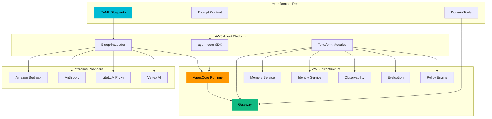

# Documentation

The AWS Agent Platform lets you declare AI agents in YAML and deploy them on AWS with zero boilerplate — a configuration-driven, provider-agnostic abstraction layer over the Strands Agents SDK and Amazon Bedrock AgentCore.

The platform ships four packages: `agent-core` (SDK), `prompt-registry` (versioned prompt management via S3 + DynamoDB), `mcp-artifacts` (claim-check artifact store backed by S3 + DynamoDB), and `agent-cli` (blueprint validation and deployment tooling).

---

## Sections

| Section | What's Inside |
|---------|---------------|
| [**Getting Started**](getting-started/) | Install the SDK, run your first agent, deploy to AgentCore Runtime |
| [**Concepts**](concepts/) | Mental models for the platform architecture, blueprint model, and platform-vs-domain split |
| [**Blueprints**](blueprints/) | YAML specification for agent, strategy, and workflow blueprints |
| [**Inference Providers**](inference/) | Bedrock, Anthropic, LiteLLM, and Vertex — configuration and provider-specific notes |
| [**Observability & Evaluation**](observability/) | OTEL traces, Langfuse, CloudWatch, audit logging, cost tracking, data protection, and evaluation |
| [**Identity, Policy & IAM**](policy/) | Inbound JWT auth, outbound credential injection, Cedar fine-grained access control, and IAM roles |
| [**Tools, MCP & Gateway**](tools/) | Gateway protocol translation, MCP server development, builtin tools, and artifact store |
| [**Runtime & Memory**](runtime/) | AgentCore Runtime, memory tiers, A2A protocol, and prompt registry |
| [**Infrastructure (Terraform)**](infrastructure/) | Platform, agents, workflows, and utility modules — variables, outputs, and deployment patterns |
| [**SDK Reference**](sdk/) | Terse API reference for all `agent-core` subsystems |
| [**CLI Reference**](cli/) | Command reference for `agentcli` — blueprint lint, prompt management, deployment |

---

## Architecture at a Glance

---

## Quick Links

- **Starting a new project?** Run the [Domain Repo Scaffolder](getting-started/create-domain-repo) — one command, full project structure
- **New to the platform?** Start with the [Quickstart](getting-started/quickstart)
- **Building your first agent?** Follow the [First Agent guide](getting-started/first-agent)
- **Writing a blueprint?** See the [Agent Blueprint reference](blueprints/agent-blueprint)
- **Choosing an inference provider?** See the [Inference Providers overview](inference/)
- **Setting up observability?** See [Observability & Evaluation](observability/)
- **Deploying infrastructure?** Read [Deployment Patterns](infrastructure/deployment-patterns)
- **Understanding the architecture?** Explore [Concepts](concepts/)
