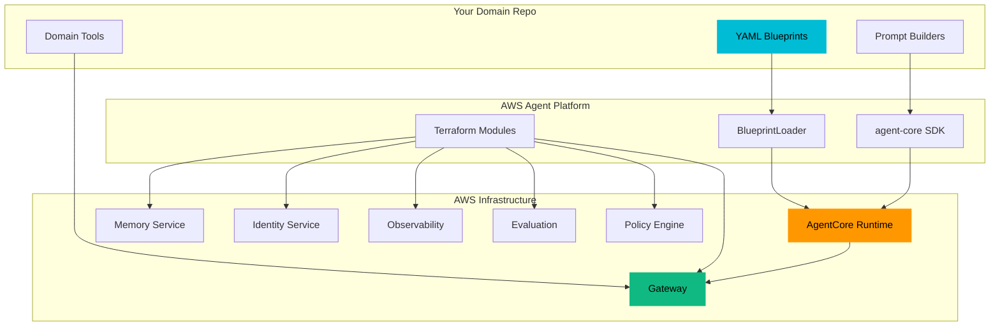

# Documentation

Welcome to the AWS Agent Platform documentation. This platform lets you declare AI agents in YAML and deploy them on AWS with zero boilerplate — built as an abstraction layer over Strands Agents SDK and Amazon Bedrock AgentCore.

---

## Sections

| Section | Description |
|---------|-------------|
| [**Getting Started**](getting-started/) | Install the SDK, create your first agent, deploy to AgentCore Runtime |
| [**Architecture**](architecture/) | The 12 building blocks, platform vs. domain separation, end-to-end flows |
| [**SDK Reference**](sdk/) | Detailed API reference for all 12 subsystems in the `agent-core` package |
| [**Infrastructure**](infrastructure/) | Terraform modules (platform, agents, workflows) and deployment patterns |
| [**CLI Reference**](cli/) | Command reference for `agentcli` — blueprint validation, prompt management, deployment |
| [**Blueprints**](blueprints/) | YAML specification for agent, strategy, and workflow blueprints |
| [**Concepts**](concepts/) | Deep mental models explaining the "why" behind each AgentCore component |

---

## Architecture at a Glance

---

## Quick Links

- **New to the platform?** Start with the [Quickstart](getting-started/quickstart)
- **Building your first agent?** Follow [First Agent](getting-started/first-agent)
- **Writing a blueprint?** See the [Agent Blueprint Spec](blueprints/agent-blueprint)
- **Deploying infrastructure?** Read [Deployment Patterns](infrastructure/deployment-patterns)
- **Understanding the architecture?** Explore the [12 Building Blocks](architecture/building-blocks)
