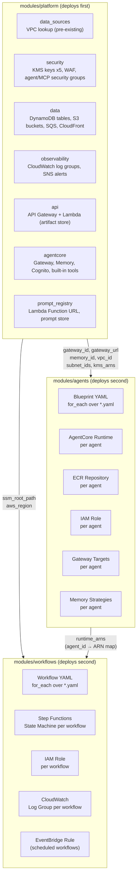

# Infrastructure

The AWS Agent Platform infrastructure is implemented as three composable Terraform modules. They are designed to be consumed from domain repositories via `source = "git::..."` references and deployed in a fixed two-phase sequence: the platform module deploys first and emits outputs that the agent and workflow modules consume.

---

## Module Overview

| Module | Path | Purpose | Deploy Order |
|--------|------|---------|--------------|
| **platform** | `modules/platform/` | Core shared infrastructure — VPC, KMS, DynamoDB, S3, AgentCore Gateway, Memory | 1st |
| **agents** | `modules/agents/` | Per-agent resources driven by blueprint YAML — Runtime, ECR, IAM, Gateway targets | 2nd |
| **workflows** | `modules/workflows/` | Per-workflow Step Functions state machines driven by workflow blueprint YAML | 2nd |

---

## Composition Diagram

---

## Shared Design Principles

**Blueprint-driven scaling.** The `agents` and `workflows` modules use `for_each` over YAML blueprint files. Adding a new agent or workflow requires only dropping a YAML file — no Terraform changes.

**Envelope encryption.** Five KMS keys are provisioned by the platform module (data, storage, secrets, platform\_artifacts, domain\_artifacts). Every data store uses the correct key. AES256 is not used when KMS is available.

**Conditional resources.** WAF, CloudFront, Cognito, and built-in tools are all gated by boolean variables. Resources are never created unconditionally when a toggle exists.

**Least-privilege IAM.** Permissions are scoped to specific ARNs wherever the API allows. Wildcards are limited to services that require them (e.g. `ecr:GetAuthorizationToken`, `xray:Put*`).

---

## Pages in This Section

| Page | Description |
|------|-------------|
| [Platform Module](./platform-module) | The `modules/platform/` reference — sub-modules, variables, outputs, usage |
| [Agents Module](./agents-module) | The `modules/agents/` reference — blueprint-driven deployment pattern |
| [Workflows Module](./workflows-module) | The `modules/workflows/` reference — Step Functions generation |
| [Deployment Patterns](./deployment-patterns) | Environment strategy, deployment sequence, cross-region access |
| [Prompt Registry Module](./prompt-registry-module) | The `modules/platform/modules/prompt_registry/` reference — Lambda + DynamoDB + S3 prompt store |
