# Agents Module

The agents module (`modules/agents/`) reads agent blueprint YAML files and creates all AWS resources required to run each agent. It uses a `for_each` pattern driven entirely by blueprint files — adding a new agent requires only dropping a YAML file in the blueprint directory. No Terraform changes are needed.

---

## How Blueprint-Driven Deployment Works

The module scans the `blueprint_dir` directory for `*.yaml` files at plan time:

```hcl
# locals.tf — simplified
blueprint_files = fileset(var.blueprint_dir, "*.yaml")

blueprints = {
  for f in local.blueprint_files :
  yamldecode(file("${var.blueprint_dir}/${f}")).id => yamldecode(file("${var.blueprint_dir}/${f}"))
}
```

The blueprint `id` field becomes the map key. Every resource in the module iterates over this map:

```hcl
resource "aws_ecr_repository" "agent" {
  for_each = local.blueprints
  name     = "${local.name_prefix}-${each.key}"
  # ...
}
```

This means `terraform plan` sees exactly one set of resources per blueprint file. Removing a YAML file removes the resources on the next apply.

---

## Resources Provisioned Per Agent

```mermaid
flowchart TD
    YAML["agent.yaml"] --> LOC["locals.tf\nyamldecode"]
    LOC --> IAM["aws_iam_role + policies\nleast-privilege Bedrock + ECR access"]
    LOC --> ECR["aws_ecr_repository\nKMS-encrypted, immutable tags"]
    LOC --> CB["aws_codebuild_project\nARM64 Docker build pipeline"]
    LOC --> RT["aws_bedrockagentcore_agent_runtime\nmicroVM Runtime with container config"]
    LOC --> EP["aws_bedrockagentcore_agent_runtime_endpoint\nNetwork endpoint for Runtime"]
    LOC --> GW["aws_bedrockagentcore_agent_runtime_target\nGateway tool targets (per agent)"]
    LOC --> MS["aws_bedrockagentcore_memory_strategy\nper strategy in memory.strategies"]
    LOC --> IP_AK["aws_bedrockagentcore_api_key_credential_provider\nper api_key credential"]
    LOC --> IP_OA["aws_bedrockagentcore_oauth2_credential_provider\nper oauth credential"]
    LOC --> SSM["aws_ssm_parameter\nRuntime ARN, ECR URL, endpoint"]
```



| Resource | Count | Driven By |
|----------|-------|-----------|
| `aws_iam_role` | 1 per agent | Blueprint `id` |
| `aws_ecr_repository` | 1 per agent | Blueprint `id` |
| `aws_codebuild_project` | 1 per agent | Blueprint `id` |
| `aws_bedrockagentcore_agent_runtime` | 1 per agent | Blueprint `id` + `runtime:` block |
| `aws_bedrockagentcore_agent_runtime_endpoint` | 1 per agent | Blueprint `id` |
| Gateway targets | 0–N per agent | `gateway_targets_file` (shared) |
| `aws_bedrockagentcore_memory_strategy` | 0–N per agent | `memory.strategies` array |
| API key credential providers | 0–N per agent | `identity.credentials` (api\_key type) |
| OAuth2 credential providers | 0–N per agent | `identity.credentials` (oauth\_3lo/m2m type) |
| `aws_ssm_parameter` | 3 per agent | Runtime ARN, ECR URL, endpoint URL |

---

## Gateway Target Authentication

Gateway targets use different credential strategies depending on the target type:

| Target Type | Credential Method | Description |
|-------------|-------------------|-------------|
| Lambda | `gateway_iam_role` | Gateway assumes its IAM role to invoke Lambda. No token exchange required. |
| MCP Server (Runtime) | `oauth` | Gateway retrieves an M2M access token via Cognito and injects it as a Bearer token. |
| OpenAPI | `api_key` or `oauth` | Depends on the external service requirements. |

**Lambda targets** always use `gateway_iam_role` — this is the simplest path. The Gateway's IAM role already has `lambda:InvokeFunction` permission, so no additional credential setup is needed.

**MCP server targets** (blueprints with `protocol: MCP`) require OAuth2 credentials when `mcp_oauth2_provider_arn` is set. The module attaches an `oauth {}` block to each MCP server gateway target, referencing the platform-provisioned credential provider and scopes. When `mcp_oauth2_provider_arn` is empty, MCP server targets fall back to `gateway_iam_role`.

**MCP Runtime JWT authorizer** — when `mcp_oauth2_discovery_url` is set, MCP protocol Runtimes are automatically configured with a `custom_jwt_authorizer` that validates incoming OAuth tokens. This ensures that only requests bearing a valid M2M token from the Gateway can reach the MCP server. The authorizer uses the OIDC discovery URL to fetch signing keys and validates the `aud` claim against `mcp_oauth2_allowed_clients`.

---

## Runtime Environment Variables

Each AgentCore Runtime is created with platform outputs wired as environment variables:

| Environment Variable | Source |
|---------------------|--------|
| `AGENTCORE_GATEWAY_URL` | `var.gateway_url` (from platform module) |
| `AGENTCORE_MEMORY_ID` | `var.memory_id` (from platform module) |
| `EXECUTION_MODE` | `var.environment` (dev/staging/production) |
| `AGENT_ID` | Blueprint `id` field |
| `AWS_DEFAULT_REGION` | `var.aws_region` |
| `SSM_ROOT_PATH` | `var.ssm_root_path` |
| `BEDROCK_REGION` | `var.bedrock_region` (when non-empty) |
| `ARTIFACTS_BUCKET` | `var.artifacts_bucket_name` (when non-empty) |

---

## Input Variables

| Variable | Type | Default | Description |
|----------|------|---------|-------------|
| `environment` | `string` | — | Deployment environment |
| `resource_prefix` | `string` | — | Resource name prefix |
| `aws_region` | `string` | — | Primary AWS region |
| `bedrock_region` | `string` | `""` | Bedrock model access region |
| `ssm_root_path` | `string` | — | Root SSM path for parameter outputs |
| `blueprint_dir` | `string` | — | Path to directory containing agent YAML blueprints |
| `gateway_targets_file` | `string` | `""` | Path to `gateway-targets.yaml` for Lambda tool targets |
| `gateway_id` | `string` | — | AgentCore Gateway ID (from platform module) |
| `gateway_url` | `string` | — | AgentCore Gateway URL (from platform module) |
| `gateway_role_arn` | `string` | — | Gateway IAM role ARN (from platform module) |
| `memory_id` | `string` | — | AgentCore Memory ID (from platform module) |
| `vpc_id` | `string` | — | VPC ID (from platform module) |
| `private_subnet_ids` | `list(string)` | — | Private subnet IDs for PRIVATE network mode |
| `agent_security_group_id` | `string` | — | Security group ID for agent containers |
| `artifacts_bucket_name` | `string` | `""` | Artifacts bucket name (optional) |
| `artifacts_bucket_arn` | `string` | `""` | Artifacts bucket ARN (optional) |
| `platform_artifacts_kms_key_arn` | `string` | `""` | KMS key for platform artifact encryption |
| `domain_artifacts_kms_key_arn` | `string` | `""` | KMS key for domain artifact encryption |
| `storage_kms_key_arn` | `string` | `""` | KMS key for ECR repository encryption |
| `codebuild_source_bucket` | `string` | `""` | S3 bucket for agent source code uploads |
| `mcp_oauth2_provider_arn` | `string` | `""` | OAuth2 credential provider ARN for MCP server gateway targets. Empty uses `gateway_iam_role` fallback. |
| `mcp_oauth2_scopes` | `list(string)` | `[]` | OAuth2 scopes for MCP server gateway targets. |
| `mcp_oauth2_discovery_url` | `string` | `""` | OIDC discovery URL for MCP Runtime JWT authorizer. Empty disables authorizer. |
| `mcp_oauth2_allowed_clients` | `list(string)` | `[]` | Allowed OAuth2 client IDs for MCP Runtime JWT authorizer. |
| `tags` | `map(string)` | `{}` | Additional resource tags |

---

## Outputs

| Output | Type | Description |
|--------|------|-------------|
| `runtime_arns` | `map(string)` | Map of `agent_id` → AgentCore Runtime ARN |
| `runtime_names` | `map(string)` | Map of `agent_id` → AgentCore Runtime name |
| `ecr_repository_urls` | `map(string)` | Map of `agent_id` → ECR repository URL |
| `agent_ids` | `list(string)` | List of all agent IDs parsed from blueprint YAML |
| `runtime_endpoint_urls` | `map(string)` | Map of `agent_id` → Runtime Endpoint URL |

---

## Usage Example

```hcl
module "agents" {
  source = "git::https://github.com/your-org/aws-agent-platform.git//modules/agents?ref=v1.0.0"

  environment     = var.environment
  resource_prefix = "myplatform"
  aws_region      = var.aws_region
  bedrock_region  = "${AWS_BEDROCK_REGION}"
  ssm_root_path   = "/myplatform/${var.environment}"

  # Blueprint source
  blueprint_dir        = "${path.module}/blueprints/agents"
  gateway_targets_file = "${path.module}/blueprints/gateway-targets.yaml"

  # Platform module outputs
  gateway_id              = module.platform.gateway_id
  gateway_url             = module.platform.gateway_url
  gateway_role_arn        = module.platform.gateway_role_arn
  memory_id               = module.platform.memory_id
  vpc_id                  = module.platform.vpc_id
  private_subnet_ids      = module.platform.private_subnet_ids
  agent_security_group_id = module.platform.agent_security_group_id
  storage_kms_key_arn     = module.platform.storage_kms_key_arn

  # OAuth2 MCP target authentication (conditional on cognito_enabled)
  mcp_oauth2_provider_arn    = module.platform.mcp_oauth2_provider_arn
  mcp_oauth2_scopes          = module.platform.mcp_oauth2_scopes
  mcp_oauth2_discovery_url   = module.platform.mcp_oauth2_discovery_url
  mcp_oauth2_allowed_clients = module.platform.mcp_oauth2_allowed_clients

  tags = {
    Project   = "my-agent-platform"
    ManagedBy = "Terraform"
  }
}
```

---

## ECR Push Workflow

Each agent has a CodeBuild project configured for ARM64 (Graviton) builds. Agent source code is uploaded to S3, CodeBuild builds the Docker image, and pushes it to ECR. The Runtime then pulls the image.

```bash
# Upload source
aws s3 cp agent-source.zip s3://${SOURCE_BUCKET}/agents/researcher/source.zip

# Trigger build
aws codebuild start-build \
  --project-name myplatform-dev-researcher \
  --source-location-override s3://${SOURCE_BUCKET}/agents/researcher/source.zip
```

See [Deployment Patterns](./deployment-patterns) for the full build sequence.

---

## Adding a New Agent

1. Create a new YAML file in `blueprint_dir` (e.g. `blueprints/agents/classifier.yaml`)
2. Set a unique `id` field
3. Run `terraform plan` — Terraform will show the new resources to be created
4. Run `terraform apply`
5. Push the container image to the new ECR repository
6. The Runtime becomes available for invocation

No Terraform code changes are required.
