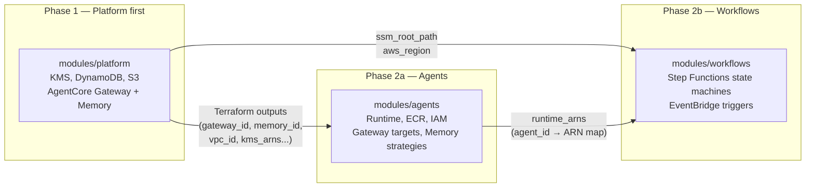

# Deployment Patterns

This page covers how to deploy the three core modules in sequence, manage multiple environments, and handle cross-region Bedrock access.

---

## The Three-Phase Deployment Model



**Phase 1 must complete before Phase 2 begins.** The agents and workflows modules depend on platform outputs. If deployed in the wrong order, Terraform will error on unknown values.

Within Phase 2, the agents module must complete before the workflows module, because workflows need `module.agents.runtime_arns`.

---

## Three-Environment Strategy

The platform defines three standard environments: `dev`, `staging`, and `production`. Each environment has a corresponding `tfvars` file.

> **Networking inputs.** All three tfvars examples below pass VPC and subnet IDs as external inputs. These values come from your separate networking project. There are no `nat_gateway_count`, `vpc_cidr`, or `availability_zones` variables in the platform module.

### `envs/dev.tfvars`

```hcl
environment    = "dev"
aws_region     = "${AWS_REGION}"
bedrock_region = "${AWS_BEDROCK_REGION}"
ssm_root_path  = "/platform/dev"

# Externally-managed networking
vpc_id              = "${VPC_ID}"
private_subnet_ids  = ["${PRIVATE_SUBNET_A}", "${PRIVATE_SUBNET_B}"]
public_subnet_ids   = ["${PUBLIC_SUBNET_A}", "${PUBLIC_SUBNET_B}"]
isolated_subnet_ids = []

waf_enabled            = false
cloudfront_enabled     = false
removal_policy_destroy = true
log_retention_days     = 7
```

### `envs/staging.tfvars`

```hcl
environment    = "staging"
aws_region     = "${AWS_REGION}"
bedrock_region = "${AWS_BEDROCK_REGION}"
ssm_root_path  = "/platform/staging"

vpc_id              = "${VPC_ID}"
private_subnet_ids  = ["${PRIVATE_SUBNET_A}", "${PRIVATE_SUBNET_B}"]
public_subnet_ids   = ["${PUBLIC_SUBNET_A}", "${PUBLIC_SUBNET_B}"]
isolated_subnet_ids = []

waf_enabled            = true
cloudfront_enabled     = true
removal_policy_destroy = false
log_retention_days     = 14
```

### `envs/production.tfvars`

```hcl
environment    = "production"
aws_region     = "${AWS_REGION}"
bedrock_region = "${AWS_BEDROCK_REGION}"
ssm_root_path  = "/platform/production"

vpc_id              = "${VPC_ID}"
private_subnet_ids  = ["${PRIVATE_SUBNET_A}", "${PRIVATE_SUBNET_B}", "${PRIVATE_SUBNET_C}"]
public_subnet_ids   = ["${PUBLIC_SUBNET_A}", "${PUBLIC_SUBNET_B}", "${PUBLIC_SUBNET_C}"]
isolated_subnet_ids = []

waf_enabled            = true
cloudfront_enabled     = true
removal_policy_destroy = false
log_retention_days     = 30
dynamodb_billing_mode  = "PAY_PER_REQUEST"
```

Key differences across environments:

| Setting | dev | staging | production |
|---------|-----|---------|------------|
| WAF | disabled | enabled | enabled |
| CloudFront | disabled | enabled | enabled |
| Removal policy | destroy | retain | retain |
| Log retention | 7 days | 14 days | 30 days |

---

## Complete Deployment Sequence

### Initial Deploy

```bash
# 1. Deploy platform infrastructure
cd infra
terraform init
terraform plan  -var-file=envs/dev.tfvars
terraform apply -var-file=envs/dev.tfvars

# 2. (Optional) read key outputs — or rely on the SSM parameters written automatically
GATEWAY_ID=$(terraform output -raw gateway_id)
MEMORY_ID=$(terraform output -raw memory_id)
VPC_ID=$(terraform output -raw vpc_id)
```

In practice, the three modules are wired together in a root module so Terraform resolves outputs automatically:

```hcl
module "platform" {
  source = "git::https://github.com/The-Cloud-Clockwork/tcc-aws-agent-platform.git//modules/platform?ref=v1.0.0"

  vpc_id             = var.vpc_id
  private_subnet_ids = var.private_subnet_ids
  # ...
}

module "agents" {
  source     = "git::https://github.com/The-Cloud-Clockwork/tcc-aws-agent-platform.git//modules/agents?ref=v1.0.0"
  depends_on = [module.platform]

  gateway_id              = module.platform.gateway_id
  gateway_url             = module.platform.gateway_url
  memory_id               = module.platform.memory_id
  codebuild_source_bucket = module.platform.codebuild_source_bucket
  # ...
}

module "workflows" {
  source     = "git::https://github.com/The-Cloud-Clockwork/tcc-aws-agent-platform.git//modules/workflows?ref=v1.0.0"
  depends_on = [module.agents]

  agent_runtime_arns = module.agents.runtime_arns
  # ...
}
```

---

## ECR Push and Runtime Update Workflow

After infrastructure is deployed, push agent container images:

```bash
# Authenticate to ECR
aws ecr get-login-password --region ${AWS_REGION} | \
  docker login --username AWS --password-stdin \
  $(aws sts get-caller-identity --query Account --output text).dkr.ecr.${AWS_REGION}.amazonaws.com

# Build for ARM64 (required for AgentCore — Graviton)
docker buildx build \
  --platform linux/arm64 \
  -t myplatform-dev-my-agent:latest \
  --push \
  -f agents/my-agent/Dockerfile \
  agents/my-agent/

# Or use the CodeBuild project provisioned by the agents module
aws s3 cp agents/my-agent/ s3://${SOURCE_BUCKET}/agents/my-agent/ --recursive
aws codebuild start-build --project-name myplatform-dev-my-agent
```

---

## Cross-Region Bedrock Access

Bedrock models are typically accessed from a dedicated region (set via `bedrock_region`) that may differ from the primary deployment region. The platform module accepts a separate `bedrock_region` variable and wires it as `BEDROCK_REGION` into every Runtime's environment.

```hcl
provider "aws" {
  alias  = "bedrock"
  region = var.bedrock_region
}
```

The SDK resolves the Bedrock region from the `BEDROCK_REGION` environment variable at runtime. No model IDs or regions are hardcoded.

---

## Network Modes

Agents support two network modes controlled by the `runtime.network_mode` field in their blueprint:

| Mode | Description | Use When |
|------|-------------|----------|
| `PUBLIC` | Runtime has outbound internet access | Agent needs to reach external APIs |
| `VPC` | Runtime is VPC-only (private subnets, no public IP) | Sensitive workloads, internal-only tool access |

For `VPC` mode, the Terraform module automatically wires `private_subnet_ids` and `agent_security_group_id` from the platform module into the Runtime's `network_configuration` block. No extra blueprint configuration is needed.

---

## Promoting Between Environments

The recommended promotion flow is:

```
dev → staging → production
```

Each promotion step:

1. Update `execution_modes:` in blueprint YAML to enable the target environment.
2. Deploy the agents/workflows modules with the target `tfvars`.
3. Run integration tests against the new environment.
4. Set `execution_modes.production: true` when ready for production.

Strategy blueprints follow the same model — `execution_modes.production` defaults to `false` and must be explicitly enabled.

---

## State Management

Each environment maintains its own Terraform state. Recommended backend configuration:

```hcl
terraform {
  backend "s3" {
    bucket         = "my-terraform-state"
    key            = "platform/${var.environment}/terraform.tfstate"
    region         = "${AWS_REGION}"
    encrypt        = true
    dynamodb_table = "terraform-state-lock"
  }
}
```

Platform outputs shared with downstream modules can be read from Terraform state using `data "terraform_remote_state"` or from SSM parameters (written automatically under `${ssm_root_path}/`). SSM parameters are the preferred cross-module interface — they do not require shared state bucket access.
