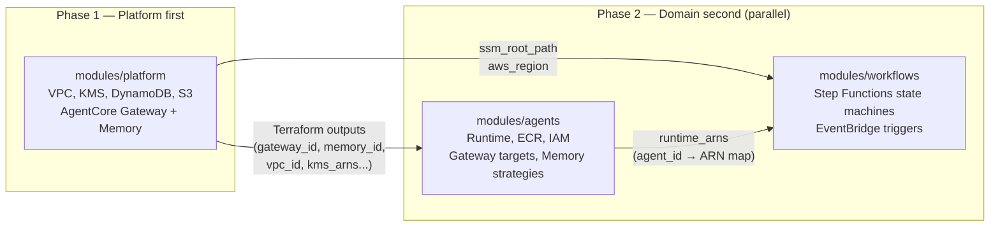

# Deployment Patterns

This page covers how to deploy the three platform modules in sequence, manage multiple environments, and handle cross-region Bedrock access.

---

## The Two-Phase Deployment Model

The platform follows a strict two-phase deployment sequence:



**Phase 1 must complete before Phase 2 begins.** The agents and workflows modules depend on platform outputs. If deployed in the wrong order, Terraform will error on unknown values.

Within Phase 2, the agents module must complete before the workflows module, because workflows need `module.agents.runtime_arns`.

---

## Three-Environment Strategy

The platform defines three standard environments: `dev`, `staging`, and `production`. Each environment has a corresponding `tfvars` file.

### `envs/dev.tfvars`

```hcl
environment    = "dev"
aws_region     = "${AWS_REGION}"
bedrock_region = "${AWS_BEDROCK_REGION}"
ssm_root_path  = "/platform/dev"

nat_gateway_count      = 1
waf_enabled            = false
cloudfront_enabled     = false
removal_policy_destroy = true
log_retention_days     = 7
```

### `envs/staging.tfvars`

```hcl
environment    = "staging"
aws_region     = "${AWS_REGION}"
bedrock_region = "${AWS_BEDROCK_REGION}"
ssm_root_path  = "/platform/staging"

nat_gateway_count      = 1
waf_enabled            = true
cloudfront_enabled     = true
removal_policy_destroy = false
log_retention_days     = 14
```

### `envs/production.tfvars`

```hcl
environment    = "production"
aws_region     = "${AWS_REGION}"
bedrock_region = "${AWS_BEDROCK_REGION}"
ssm_root_path  = "/platform/production"

nat_gateway_count      = 3    # One per AZ for HA
waf_enabled            = true
cloudfront_enabled     = true
removal_policy_destroy = false
log_retention_days     = 30
dynamodb_billing_mode  = "PAY_PER_REQUEST"
```

Key differences across environments:

| Setting | dev | staging | production |
|---------|-----|---------|------------|
| NAT gateways | 1 | 1 | 3 (HA) |
| WAF | disabled | enabled | enabled |
| CloudFront | disabled | enabled | enabled |
| Removal policy | destroy | retain | retain |
| Log retention | 7 days | 14 days | 30 days |

---

## Complete Deployment Sequence

### Initial Deploy (all environments)

```bash
cd modules/platform

# 1. Initialise and deploy platform infrastructure
terraform init
terraform plan -var-file=envs/dev.tfvars
terraform apply -var-file=envs/dev.tfvars

# 2. Capture outputs for downstream modules
GATEWAY_ID=$(terraform output -raw gateway_id)
GATEWAY_URL=$(terraform output -raw gateway_url)
GATEWAY_ROLE=$(terraform output -raw gateway_role_arn)
MEMORY_ID=$(terraform output -raw memory_id)
VPC_ID=$(terraform output -raw vpc_id)

cd ../agents

# 3. Deploy agents (requires platform outputs)
terraform init
terraform plan -var-file=envs/dev.tfvars
terraform apply -var-file=envs/dev.tfvars

# 4. Capture runtime ARNs for workflows
RUNTIME_ARNS=$(terraform output -json runtime_arns)

cd ../workflows

# 5. Deploy workflows (requires agents outputs)
terraform init
terraform plan -var-file=envs/dev.tfvars
terraform apply -var-file=envs/dev.tfvars
```

In practice, these three modules are typically wired together in a root module:

```hcl
module "platform" {
  source = "git::https://github.com/your-org/aws-agent-platform.git//modules/platform?ref=v1.0.0"
  # ...
}

module "agents" {
  source     = "git::https://github.com/your-org/aws-agent-platform.git//modules/agents?ref=v1.0.0"
  depends_on = [module.platform]

  gateway_id   = module.platform.gateway_id
  gateway_url  = module.platform.gateway_url
  memory_id    = module.platform.memory_id
  # ...
}

module "workflows" {
  source     = "git::https://github.com/your-org/aws-agent-platform.git//modules/workflows?ref=v1.0.0"
  depends_on = [module.agents]

  agent_runtime_arns = module.agents.runtime_arns
  # ...
}
```

---

## ECR Push and Runtime Update Workflow

After the infrastructure is deployed, push agent container images:

```bash
# Authenticate to ECR
aws ecr get-login-password --region ${AWS_REGION} | \
  docker login --username AWS --password-stdin \
  $(aws sts get-caller-identity --query Account --output text).dkr.ecr.${AWS_REGION}.amazonaws.com

# Build for ARM64 (required for AgentCore — Graviton)
docker buildx build \
  --platform linux/arm64 \
  -t myplatform-dev-researcher:latest \
  --push \
  -f agents/researcher/Dockerfile \
  agents/researcher/

# Or use the CodeBuild project provisioned by the agents module
aws s3 cp agents/researcher/ s3://${SOURCE_BUCKET}/agents/researcher/ --recursive
aws codebuild start-build --project-name myplatform-dev-researcher
```

After the image is pushed, the AgentCore Runtime automatically picks it up on the next invocation (or can be refreshed via the console).

---

## Cross-Region Bedrock Access

Bedrock models are typically accessed from a dedicated region (set via `bedrock_region`) that may differ from the primary deployment region. The platform module accepts a separate `bedrock_region` variable and wires it as `BEDROCK_REGION` into every Runtime's environment.

A cross-region Bedrock provider alias is declared in `providers.tf`:

```hcl
provider "aws" {
  alias  = "bedrock"
  region = var.bedrock_region
}
```

The SDK resolves the Bedrock region from the `BEDROCK_REGION` environment variable at runtime. No model IDs or regions are hardcoded.

---

## Network Modes

Agents support two network modes controlled by the `runtime.network_mode` field in their blueprint:

| Mode | Description | Use When |
|------|-------------|----------|
| `PUBLIC` | Runtime has outbound internet access | Agent needs to reach external APIs |
| `VPC` | Runtime is VPC-only (private subnets, no public IP) | Sensitive workloads, internal-only tool access |

For `VPC` mode, the Terraform module automatically wires `private_subnet_ids` and `agent_security_group_id` from the platform module into the Runtime's `network_configuration` block. No additional configuration is needed in the blueprint.

VPC endpoints for `ecr.dkr`, `ecr.api`, `s3`, and `ssm` are provisioned by the network sub-module to ensure VPC-mode agents can reach required services without traversing the internet.

> **Note:** A VPC endpoint for the `bedrock-agentcore` service is aspirational. As of March 2026, verify that the `com.amazonaws.<region>.bedrock-agentcore` endpoint service is available in your region before enabling it. The network sub-module includes a placeholder that can be activated once the endpoint is GA.

---

## Promoting Between Environments

The recommended promotion flow is:

```
dev → staging → production
```

Each promotion step involves:

1. Updating `execution_modes:` in blueprint YAML to enable the target environment
2. Deploying the agents/workflows modules with the target `tfvars`
3. Running integration tests against the new environment
4. Updating `execution_modes.production: true` when ready for production promotion

Strategy blueprints follow the same model — `execution_modes.production` defaults to `false` and must be explicitly enabled.

---

## State Management

Each environment maintains its own Terraform state. The recommended backend configuration:

```hcl
terraform {
  backend "s3" {
    bucket         = "my-terraform-state"
    key            = "platform/${var.environment}/terraform.tfstate"
    region         = "${AWS_REGION}"
    encrypt        = true
    dynamodb_table = "terraform-state-lock"
  }
}
```

Platform outputs shared with downstream modules should be read from Terraform state using `data "terraform_remote_state"` or from SSM parameters (which the platform module writes automatically under `${ssm_root_path}/`). SSM parameters are the preferred cross-module interface because they do not require shared state access.
