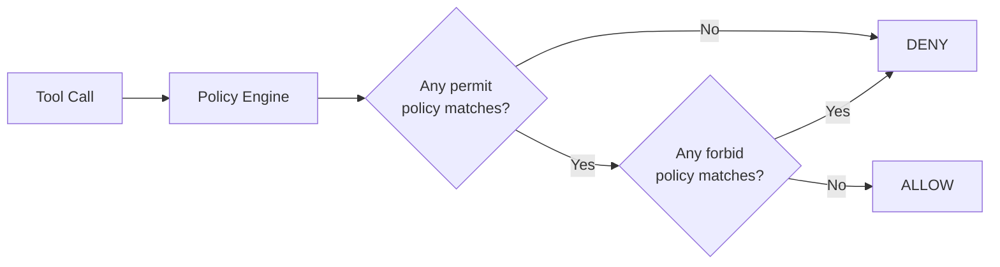

# Fine-Grained Access Control with Cedar

AgentCore Policy inserts a Cedar policy engine between the Gateway and its tool
targets. Every tool call is evaluated against your declared rules before it
reaches any backend. The agent's application code is not involved — the policy
engine operates as a sidecar at the Gateway layer.

## Why Cedar, Not RBAC

Role-based access control (RBAC) answers "can this user call this tool?" Cedar
answers "can this user call this tool *with these parameters* right now?" That
distinction is critical for autonomous agents.

Agents make decisions about which tools to invoke and with what arguments. A
blunt RBAC check ("role=analyst can call process_request") cannot prevent an
analyst from calling `process_request(amount=10000000)`. Cedar evaluates the
actual input parameters as part of the policy decision.

Cedar is also:

- **Default DENY** — an empty engine blocks everything. You explicitly permit
  what is allowed, not the other way around.
- **Composable** — multiple policies combine with standard `permit`/`forbid`
  semantics. A `forbid` is an absolute override.
- **Auditable** — every decision is loggable with full context (principal,
  action, resource, input values).

## Where the Policy Engine Sits

```
Agent → Gateway → Policy Engine (Cedar) → ALLOW/DENY → Tool backend
```

The policy engine attaches to the Gateway, not the Runtime. This means:

- All agents using the same Gateway share the same policy engine.
- Agent code does not need to know about policies — it calls tools normally.
- Policy enforcement is centralized and consistent across all callers.
- Policy decisions are made against the **caller's JWT claims** (user ID,
  groups, scopes), not the agent's IAM role.

The agent carries the user's JWT when calling the Gateway. Cedar reads the
claims from that token to make the allow/deny decision. The agent's IAM role
controls what AWS actions it can perform; Cedar controls which tools it can
invoke on behalf of a given user.

## The Default DENY Model



An empty policy engine denies all tool calls. You must write explicit `permit`
statements for every tool-user combination you want to allow. If a new tool is
added to the Gateway and no policy covers it, it remains unreachable until a
policy is written.

## Two Enforcement Modes

| Mode | Effect |
|------|--------|
| `ENFORCE` | Unauthorized calls are blocked. The agent receives an authorization error. |
| `LOG_ONLY` | All calls proceed. Unauthorized decisions are logged but not blocked. |

Use `LOG_ONLY` when rolling out a new policy engine to observe what would be
blocked before enforcing it. Switch to `ENFORCE` once the policy is validated.

```yaml
policy:
  engine: MyPolicyEngine
  mode: ENFORCE   # or LOG_ONLY
```

## Entity Namespaces

Cedar policies in this platform use specific entity namespaces produced by the
translator. Actions and resources take the following forms:

| Entity | Cedar form |
|--------|-----------|
| Tool action | `AgentCore::Action::"TargetName___tool_name"` |
| Gateway resource | `AgentCore::Gateway::"<gateway_arn>"` |
| Specific principal | `AgentCore::Principal::"<id>"` |

The `___` separator (three underscores) combines the Gateway target name and the
tool name. When `target_prefix` is set in the blueprint, that prefix is applied
globally. Individual rules can override with a `target:` field.

## Cedar Policy Patterns

Cedar follows the form: `permit/forbid (principal, action, resource) [when/unless condition]`

### Allow all callers to invoke a tool

```cedar
permit(
  principal,
  action == AgentCore::Action::"DataTarget___search_records",
  resource == AgentCore::Gateway::"<gateway_arn>"
);
```

### Restrict by input parameter value

```cedar
permit(
  principal,
  action == AgentCore::Action::"DataTarget___search_records",
  resource == AgentCore::Gateway::"<gateway_arn>")
when { context.input.limit <= 100 };
```

Any caller can search, but only with a result limit of 100 or fewer. Requests
with `limit=1000` are denied even though the principal has a permit.

### Restrict by JWT claim (user group)

```cedar
forbid(
  principal,
  action == AgentCore::Action::"ApprovalTarget___approve_request",
  resource == AgentCore::Gateway::"<gateway_arn>")
unless {
  principal has scope &&
  principal.scope.contains("group:Managers")
};
```

Only callers with `group:Managers` in their JWT scope can call `approve_request`.
All other callers are forbidden regardless of any other permit policies.

### Combine parameter and group checks

```cedar
permit(
  principal,
  action == AgentCore::Action::"OrderTarget___process_order",
  resource == AgentCore::Gateway::"<gateway_arn>")
when {
  context.input.amount <= 500 ||
  (principal has scope && principal.scope.contains("group:SeniorStaff"))
};
```

Any caller can process orders up to 500. Senior staff can process any amount.

### Geography-based constraints

```cedar
forbid(
  principal,
  action == AgentCore::Action::"DataTarget___export_records",
  resource == AgentCore::Gateway::"<gateway_arn>")
unless {
  principal has locale &&
  principal.locale.region == "EU"
};
```

Only callers with an EU locale in their JWT claims can export records. Useful
for data residency requirements that must be enforced at the tool level.

## Declaring Rules in Blueprints

The `policy:` block uses a simplified YAML format. The platform translates each
rule into Cedar and deploys it to the policy engine automatically.

```yaml
policy:
  engine: DataServicePolicies
  mode: ENFORCE
  target_prefix: DataServiceTarget   # prepended to all action names
  rules:
    - name: allow-search
      allow: search_records          # generates permit(...DataServiceTarget___search_records...)

    - name: limit-search-results
      allow: search_records
      when: "context.input.limit <= 100"

    - name: managers-only-approve
      deny: approve_request          # generates forbid(...)
      unless: "principal.scope.contains('group:Managers')"

    - name: data-team-bulk-export
      allow: bulk_export
      target: AnalyticsTarget        # overrides target_prefix for this rule only
      unless: "principal.scope.contains('group:DataTeam')"

  versioning:
    enabled: true
    table_env: POLICY_VERSIONS_TABLE   # DynamoDB table for Cedar snapshot history
    max_versions: 10
```

Each rule must set exactly one of `allow` (generates `permit`) or `deny`
(generates `forbid`). `when` and `unless` accept raw Cedar condition
expressions that are passed through verbatim.

Generate and inspect the Cedar before deploying:

```bash
agentcli policy lint agents/my-agent.yaml
agentcli policy generate agents/my-agent.yaml \
  --gateway-arn arn:aws:bedrock-agentcore:<region>:<account>:gateway/<id> \
  --output policies/my-agent.cedar
```

## Policy Versioning and Rollback

When `versioning:` is configured in the `policy:` block, every policy
deployment is snapshotted to DynamoDB as a numbered version. The platform stores
the full Cedar statements, policy IDs, engine ID, and enforcement mode. You can
list and restore any prior version:

```python
from agent_core.policy.wiring import PolicyWiring

# During agent session build, PolicyWiring is instantiated automatically.
# Access it from the loader to call rollback:
wiring.list_versions()     # → list of {version, timestamp_ms, rules_hash, mode, ...}
wiring.rollback(version=3) # redeploys Cedar from snapshot 3, re-attaches to Gateway
```

Rollback deletes the current policies, recreates them from the stored Cedar
statements, and re-attaches the engine to the Gateway. The engine itself (and
its ID) is preserved.

## NL-to-Cedar Translation

For initial policy authoring, the Policy SDK supports natural-language
generation via the AgentCore NL2Cedar API:

```python
from agent_core.policy.client import PolicyClient

client = PolicyClient(region="${AWS_REGION}")
result = client.generate_policy(
    engine_id=engine_id,
    name="search-limit-policy",
    gateway_arn="arn:aws:bedrock-agentcore:<region>:<account>:gateway/<id>",
    natural_language="Allow users to search records only when the limit is 100 or fewer",
    fetch_assets=True,  # fetches tool schemas from Gateway for context
)
# result["generatedPolicies"] contains the Cedar text — review before deploying
```

NL-to-Cedar is a starting point. Review the generated Cedar before adding it to
the engine. Access control decisions should be human-reviewed.

## How Policies Compose

Cedar evaluation order is deterministic:

1. If **any** `forbid` matches → DENY (absolute, overrides all permits).
2. Else if **any** `permit` matches → ALLOW.
3. Else → DENY (default).

Use `forbid` rules for unconditional safety rails — "never allow calls with PII
in parameters" — that must hold regardless of other policies. Use `permit` rules
for conditional access grants.

## SDK Reference

| Symbol | Module | Purpose |
|--------|--------|---------|
| `CedarPolicy` | `agent_core.policy.cedar_policies` | Single Cedar policy rule as a dataclass |
| `CedarPolicyBuilder` | `agent_core.policy.cedar_policies` | Build and serialize a Cedar policy set (`add_policy`, `build`, `write_to_file`) |
| `PolicyClient` | `agent_core.policy.client` | Engine lifecycle, policy CRUD, NL2Cedar, Gateway attachment |
| `PolicyWiring` | `agent_core.policy.wiring` | Orchestrates blueprint → Cedar → deploy → attach lifecycle |
| `translate_rule` | `agent_core.policy.translator` | Translate one `PolicyRuleConfig` to a Cedar statement |
| `translate_rules` | `agent_core.policy.translator` | Translate a list of rules to a Cedar policy set |
| `PolicyMode` | `agent_core.policy.client` | `ENFORCE` or `LOG_ONLY` enum |

`CedarPolicyBuilder` exposes four methods: `add_policy(CedarPolicy)`,
`load_policies_from_file(path)`, `build()`, and `write_to_file(path)`. Policies
are constructed as `CedarPolicy` dataclass instances — there is no fluent
method chain.

## See Also

- [Identity](identity) — how JWT claims are validated before the policy engine sees them
- [IAM](iam) — the IAM roles that back Gateway and Runtime execution
- [Gateway Concepts](../tools/gateway) — where the policy engine attaches in the architecture
