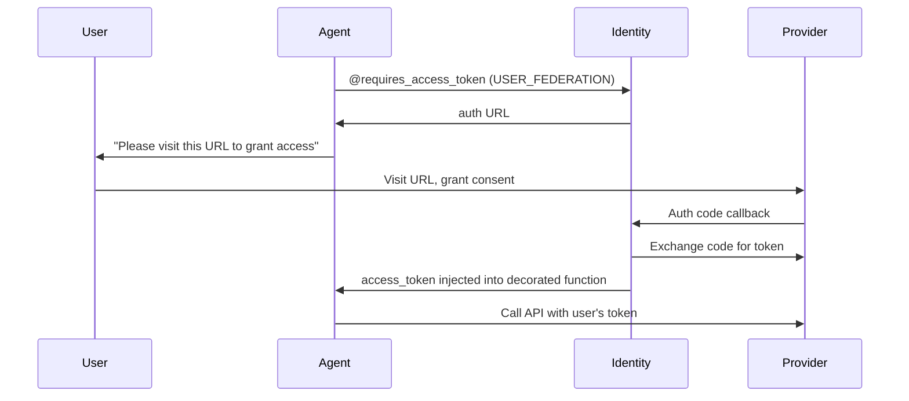
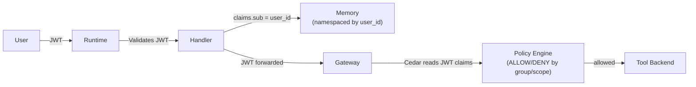

# How Auth Flows Through the System

AgentCore Identity manages authentication at every boundary in the platform:
inbound (who can call your agent), outbound (what credentials your agent uses),
and between agents (machine-to-machine tokens). The underlying model is
**delegation**, not impersonation.

## The Delegation Model

Agents authenticate as themselves while carrying verifiable user context. An
agent never pretends to be the user — it proves that the user authorized it to
act, and each downstream service independently decides what the agent may do on
that user's behalf.

This distinction matters because agents are autonomous. A single user request
can trigger dozens of tool calls, branching decisions, and sub-agent
delegations. At each step you need to know both *who the user is* (for
authorization and audit) and *that the agent is legitimately acting for them*
(for trust).

## Inbound Authorizer Types

Three inbound authorizer types are supported, set via the `identity.authorizer`
block in the agent blueprint:

| Type | When to use |
|------|-------------|
| `cognito_jwt` | Cognito User Pool — requires `user_pool_id` and `client_id` |
| `custom_jwt` | Any OIDC-compliant provider — requires `discovery_url` and `allowed_clients` |
| `aws_iam` | SigV4 request signing — no JWT; caller signs requests with an IAM identity |

The Runtime validates tokens (or SigV4 signatures for `aws_iam`) before your
`@app.entrypoint` fires. Invalid tokens are rejected at the Runtime boundary.

## Five Auth Patterns

### Pattern 1: Inbound JWT Validation

Protect your agent from unauthorized callers by declaring an authorizer.

With a Cognito User Pool:

```yaml
identity:
  authorizer:
    type: cognito_jwt
    user_pool_id: ${COGNITO_USER_POOL_ID}
    client_id: ${COGNITO_CLIENT_ID}
```

With any OIDC provider:

```yaml
identity:
  authorizer:
    type: custom_jwt
    discovery_url: ${OIDC_DISCOVERY_URL}
    allowed_clients:
      - ${CLIENT_ID}
```

With AWS IAM (SigV4):

```yaml
identity:
  authorizer:
    type: aws_iam
```

> **Under the hood:** `cognito_jwt` and `custom_jwt` configure a
> `customJWTAuthorizer` on the Runtime with a `discoveryUrl` pointing to the
> OIDC well-known endpoint. The Runtime fetches signing keys from that URL and
> validates token signatures, expiry, and audience claims before routing
> requests to your entrypoint. `aws_iam` delegates to AgentCore's built-in
> SigV4 verification — no OIDC configuration required.

Inside the handler, the token has already been validated. Decode it to extract
user identity without re-verifying the signature:

```python
@app.entrypoint
async def handle(context):
    token = context.request_headers.get("authorization", "").replace("Bearer ", "")
    claims = jwt.decode(token, options={"verify_signature": False})
    user_id = claims.get("sub")
    # user_id is the authenticated caller — safe to use for memory scoping,
    # policy context, audit logs, etc.
```

### Pattern 2: Outbound API Key Injection

Your agent needs a third-party API key (a search service, a data API). You do
not want the key in your codebase or container image.

Credential providers are provisioned in two ways:

**Via Terraform (recommended):** The agents module reads the API key from an
SSM SecureString parameter and creates an AgentCore credential provider. The
SSM parameter must be populated before `terraform apply`:

```bash
aws ssm put-parameter --type SecureString \
  --name "/my-platform/agents/my-agent/credentials/search-api/api-key" \
  --value "sk-..."
```

**Via SDK (one-time setup):** Register the provider using the Identity client:

```python
from bedrock_agentcore.services.identity import IdentityClient

identity_client = IdentityClient(region="${AWS_REGION}")
identity_client.create_api_key_credential_provider(
    secret_name="my-search-api-key-secret"  # Secrets Manager secret name
)
```

After the provider is registered, your agent retrieves the key at runtime via a
decorator:

```python
from bedrock_agentcore.identity.auth import requires_api_key

@requires_api_key(provider_name="search-api-key-provider")
async def init_search_client(*, api_key: str):
    os.environ["SEARCH_API_KEY"] = api_key  # injected by Identity at call time
```

The key never appears in application code or environment variables baked into
the image.

### Pattern 3: Three-Legged OAuth (User Consent)

Your agent needs to access a resource that belongs to the user — their calendar,
their repositories, their cloud storage. This requires the user's OAuth consent,
not just the agent's credentials.



```python
@tool(name="get_calendar_events")
async def get_calendar():
    @requires_access_token(
        provider_name="calendar-provider",
        scopes=["https://www.googleapis.com/auth/calendar.readonly"],
        auth_flow="USER_FEDERATION",
        on_auth_url=lambda url: print(f"Please visit: {url}"),
        callback_url="${CALLBACK_URL}",
    )
    async def get_events(access_token: str = "") -> str:
        # access_token is the user's token — inject into the API call
        ...
    return await get_events()
```

The nested function pattern is intentional: `@requires_access_token` wraps the
inner function so the Strands tool schema derivation does not expose
`access_token` as a parameter the LLM can set.

### Pattern 4: Machine-to-Machine (Agent-to-Agent)

One agent needs to call another agent. No user consent is involved — this is
service-to-service.

```python
@requires_access_token(
    provider_name="specialist-agent-provider",
    scopes=[],
    auth_flow="M2M",
    into="bearer_token",
    force_authentication=True,
)
def create_agent_client(bearer_token: str = "") -> httpx.AsyncClient:
    return httpx.AsyncClient(headers={
        "Authorization": f"Bearer {bearer_token}",
        "X-Amzn-Bedrock-AgentCore-Runtime-Session-Id": session_id,
    })
```

Each agent has its own Cognito client credentials. The Identity service handles
token acquisition and refresh automatically.

### Pattern 5: Gateway-to-Runtime M2M (MCP Server Auth)

The Gateway needs to call MCP servers hosted on AgentCore Runtimes. Those
Runtimes must verify that the caller is the platform Gateway — not an arbitrary
client.

This is a specialized M2M pattern where the platform provisions everything
automatically. When Cognito is enabled, the platform creates:

- A **Cognito Resource Server** with custom scopes (`mcp.invoke` and
  `runtime.access`).
- A **confidential M2M client** with `client_credentials` grant type,
  authorized for these scopes.
- An **OAuth2 credential provider** that the Gateway uses to obtain access
  tokens via `GetResourceOauth2Token`.

On the receiving side, each MCP protocol Runtime is configured with a **JWT
authorizer** that validates incoming tokens against the Cognito OIDC discovery
endpoint. The authorizer checks the token signature, expiry, and `aud` claim
to confirm the token was issued for the correct client.

The token lifecycle is fully managed by AgentCore:

1. Gateway calls `GetResourceOauth2Token` on the credential provider before
   each MCP request.
2. The credential provider exchanges M2M client credentials at the Cognito
   token endpoint.
3. AgentCore caches the token and refreshes it before expiry — no application
   code involved.
4. The Runtime JWT authorizer validates the token on every inbound request.

This pattern requires no application code changes. It is configured through
Terraform variables (`mcp_oauth2_provider_arn`, `mcp_oauth2_scopes`,
`mcp_oauth2_discovery_url`, `mcp_oauth2_allowed_clients`) passed from the
platform module to the agents module.

A Terraform `precondition` block enforces that any MCP protocol Runtime with
`gateway_direct_mcp=true` must have `mcp_oauth2_discovery_url` set — the plan
fails explicitly rather than silently producing a Runtime that rejects all calls
with 403.

## Auth Pattern Summary

| Pattern | Auth Flow | When to Use |
|---------|----------|-------------|
| Inbound JWT (Cognito) | Cognito OIDC | Protect agent from unauthorized callers via user pool |
| Inbound JWT (OIDC) | Custom OIDC | Protect agent with any standards-compliant identity provider |
| Inbound IAM | SigV4 | Protect agent for same-account AWS service callers |
| API key injection | SSM → AgentCore Identity | Agent needs a static third-party credential |
| 3-legged OAuth | USER_FEDERATION | Agent needs the user's permission to access user-owned resources |
| M2M token | M2M | Agent-to-agent calls; no user consent needed |
| Gateway-to-Runtime M2M | M2M (automatic) | Gateway authenticating to MCP server Runtimes |

## How User Identity Flows Through the Stack



The user's JWT is validated once at the Runtime boundary. Inside the system:

- Memory uses `user_id` from the JWT `sub` claim for namespace scoping — each
  user's short-term and long-term memory is isolated.
- The Gateway passes the JWT to the Policy Engine, which reads claims such as
  group memberships and scopes to make allow/deny decisions per tool call.
- Tool backends never see the user's token — they receive calls from the
  Gateway's own IAM role.

## Credential Provider Lifecycle

Credentials managed by Identity are never baked into the container image or set
as plain environment variables:

1. **One-time setup:** Populate the API key or OAuth2 client secret in SSM
   SecureString (Terraform path) or Secrets Manager (SDK path). Run
   `terraform apply` to create the AgentCore credential provider.
2. **At runtime:** The Identity service fetches the credential from its secure
   store and injects it via decorators — only into the function scope that
   needs it, for the duration of that call.
3. **Rotation:** Update the value in SSM or Secrets Manager. Agents pick up the
   new credential on the next decorator invocation. No image rebuild required.

The in-process `CredentialCache` is per-container. For long-lived Runtimes with
frequently-rotating credentials, ensure the cache TTL is tuned below the
credential rotation interval so agents do not hold stale credentials.

## Identity Providers: Three Concrete Implementations

The SDK ships three identity provider classes — `CognitoProvider`,
`OktaProvider`, and `EntraProvider`. All three delegate entirely to AgentCore
Identity via the same internal resolution path (`_get_from_agentcore()`). They
are resolution wrappers, not separate auth stacks. The choice of class affects
only parameter naming (Cognito user pool ID vs Okta org URL vs Entra tenant ID),
not the underlying credential retrieval mechanism.

## See Also

- [Cedar Policy](cedar-policy) — how JWT claims are used in policy decisions after validation
- [IAM](iam) — the IAM roles that back Gateway and Runtime execution
- [A2A Concepts](../runtime/a2a) — M2M auth in multi-agent pipelines
- [Identity SDK Reference](../sdk/) — `IdentityClient`, `CredentialCache`, provider classes
