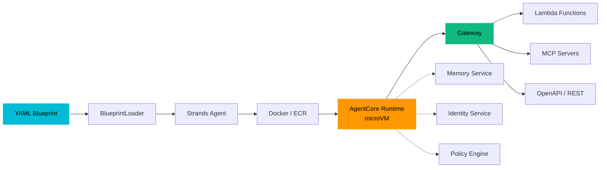

# Declare AI agents in YAML. Deploy on AWS.
{: .fs-9 }

A configuration-driven, provider-agnostic runtime for AI agents — built over **Strands Agents SDK** and **Amazon Bedrock AgentCore**. Define agents, strategies, and multi-agent workflows as YAML blueprints. The platform handles Runtime, Gateway, Memory, Identity, Policy, Observability, Evaluation, and everything in between.
{: .fs-6 }

<div class="hero-actions">
  <a href="{{ '/docs/getting-started/quickstart' | relative_url }}" class="btn btn-primary">Get Started</a>
  <a href="{{ '/docs/' | relative_url }}" class="btn btn-outline">Documentation</a>
</div>

---

## The Problem

Amazon Bedrock AgentCore provides powerful primitives for building production AI agents on AWS — Runtime, Gateway, Identity, Memory, Tools, Observability, Evaluation, Policy, A2A, and more. Wiring them together requires hundreds of lines of infrastructure code, SDK plumbing, and deployment configuration **per agent**.

**This platform eliminates that boilerplate.** You write a YAML blueprint. The platform reads it, resolves all dependencies, and produces a fully operational agent on AgentCore Runtime.

---

<div class="feature-grid">
  <div class="feature-card">
    <h3>Blueprint Engine</h3>
    <p>Define agents in YAML. The platform assembles Runtime, Gateway, Memory, Identity, Policy, and Observability from a single file. Zero glue code.</p>
  </div>
  <div class="feature-card">
    <h3>Provider-Agnostic Inference</h3>
    <p>Four inference providers out of the box: <strong>Amazon Bedrock</strong>, <strong>Anthropic</strong>, <strong>LiteLLM</strong>, and <strong>Google Vertex AI</strong>. Switch providers by changing one line in the blueprint.</p>
  </div>
  <div class="feature-card">
    <h3>Terraform Modules</h3>
    <p>Three composable modules — platform, agents, workflows. Domain repos consume via <code>module "platform" { source = "..." }</code>. No bespoke infra code needed.</p>
  </div>
  <div class="feature-card">
    <h3>Full Observability Stack</h3>
    <p>OTEL auto-instrumentation, Langfuse session tracing, structured audit logging, per-model cost tracking, and CloudWatch GenAI insights — all from zero extra code.</p>
  </div>
</div>

---

## How It Works



**One handler serves every agent.** The YAML blueprint determines which inference provider, tools, prompts, memory strategies, identity providers, and Cedar policies are wired. Your domain repo provides: prompt content, business schemas, and domain-specific tool implementations. The platform handles everything else.

---

## The 12 Building Blocks

Every agent blueprint can configure any combination of these blocks:
{: .blocks-table }

| # | Block | What It Does |
|---|-------|-------------|
| 1 | [**Runtime**]({{ '/docs/runtime/' | relative_url }}) | Hosts agents in isolated microVMs per session with streaming and OTel flush |
| 2 | [**Gateway**]({{ '/docs/tools/' | relative_url }}) | Protocol translator — Lambda, MCP, OpenAPI, and Smithy backends through one interface |
| 3 | [**Identity**]({{ '/docs/policy/' | relative_url }}) | JWT validation, API keys, OAuth 3LO, and M2M credential injection |
| 4 | [**Memory**]({{ '/docs/runtime/' | relative_url }}) | Short-term session events + long-term semantic knowledge via pgvector |
| 5 | [**Tools**]({{ '/docs/tools/' | relative_url }}) | Managed Code Interpreter, Browser, custom MCP servers, and artifact store |
| 6 | [**Observability**]({{ '/docs/observability/' | relative_url }}) | OTEL traces, Langfuse integration, audit logs, and cost tracking |
| 7 | [**Evaluation**]({{ '/docs/observability/' | relative_url }}) | 12 built-in LLM-as-judge evaluators + custom evaluators via agentcore or Langfuse |
| 8 | [**Policy**]({{ '/docs/policy/' | relative_url }}) | Cedar fine-grained access control on every Gateway tool call |
| 9 | [**Inference**]({{ '/docs/inference/' | relative_url }}) | Bedrock, Anthropic, LiteLLM, and Vertex — provider selected per blueprint |
| 10 | [**A2A**]({{ '/docs/runtime/' | relative_url }}) | Agent-to-agent discovery, delegation, and streaming via the A2A protocol |
| 11 | [**Infrastructure**]({{ '/docs/infrastructure/' | relative_url }}) | Composable Terraform modules for platform, agents, workflows, and utilities |
| 12 | [**Blueprints**]({{ '/docs/blueprints/' | relative_url }}) | Declarative YAML abstraction that drives all 11 blocks above |

---

## Quick Start

```bash
# Install the SDK and CLI
pip install agent-core agent-cli

# Validate your agent blueprint
agentcli blueprint lint blueprints/agents/my-agent.yaml

# Deploy platform infrastructure (Terraform)
cd infra/
terraform init && terraform apply

# Deploy your agent to AgentCore Runtime
agentcli deploy --env production
```

Your domain repo writes:
- **YAML blueprints** — agent, strategy, and workflow definitions
- **Prompt content** — versioned prompt files managed by the Prompt Registry
- **Domain tools** — your own Lambda functions or MCP servers

The platform handles everything else.

[Get Started]({{ '/docs/getting-started/quickstart' | relative_url }}){: .btn .btn-primary }

---

## Platform vs. Domain

| Concern | Platform (this repo) | Your Domain Repo |
|---------|---------------------|------------------|
| Blueprint parsing & validation | BlueprintLoader, schema validation | Blueprint YAML files |
| Agent runtime wiring | `@app.entrypoint`, `AgentCoreApp` | `app.py` (5-line handler) |
| Inference provider dispatch | BedrockModel, AnthropicModel, LiteLLMModel, GeminiModel | `provider:` in blueprint |
| Gateway target routing | TargetRegistry, GatewayClient | `gateway-targets.yaml` |
| Memory strategies & hooks | MemoryHookProvider, MemoryWiring | Memory config in blueprint |
| Identity provider wiring | Credential resolution, decorator injection | Identity config in blueprint |
| Cedar policy generation | PolicyWiring, translator | Policy rules in blueprint |
| Observability auto-instrumentation | OTel, LangfuseHook, CostTracker | `trace_attributes` in blueprint |
| Infrastructure deployment | Terraform modules | `module "platform" { ... }` |
| Prompt versioning | PromptRegistry (S3 + DynamoDB) | Prompt content files |
| Domain-specific tools | — | Lambda functions, custom MCPs |

---

## FAQ

<details>
<summary>What is the relationship to Amazon Bedrock AgentCore?</summary>
<p>This platform is an <strong>abstraction layer</strong> over AgentCore, not a replacement. It uses AgentCore Runtime, Gateway, Memory, Identity, and all other AgentCore services. The platform's value is turning multiple separate service configurations into one YAML blueprint per agent.</p>
</details>

<details>
<summary>Which inference providers are supported?</summary>
<p>Four providers are supported out of the box: <strong>Amazon Bedrock</strong> (default, Converse API), <strong>Anthropic</strong> (direct API), <strong>LiteLLM</strong> (proxy for any OpenAI-compatible endpoint — Ollama, vLLM, custom gateways), and <strong>Google Vertex AI</strong> (Gemini models). Provider is a single field in the blueprint's <code>model:</code> block. See the <a href="{{ '/docs/inference/' | relative_url }}">Inference Providers</a> section.</p>
</details>

<details>
<summary>Do I need to understand all 12 building blocks?</summary>
<p>No. Start with <strong>Runtime + Gateway</strong> — that gets an agent running with tools. Add Memory, Identity, Policy, and Observability incrementally as your requirements grow. Every block in the blueprint schema is optional except <code>id</code>, <code>name</code>, <code>version</code>, <code>model</code>, and <code>prompt_ref</code>.</p>
</details>

<details>
<summary>What agent frameworks are supported?</summary>
<p><strong>Strands Agents SDK</strong> is the primary framework with native AgentCore integration (BedrockModel, HookProvider, MCPClient, A2A). Any framework that exposes <code>POST /invocations</code> and <code>GET /ping</code> on port 8080 can run on AgentCore Runtime.</p>
</details>

<details>
<summary>How do domain repos consume this platform?</summary>
<p>Two ways: <strong>Terraform modules</strong> for infrastructure (<code>module "platform" { source = "git::https://github.com/your-org/aws-agent-platform.git//modules/platform?ref=v1.0.0" }</code>) and <strong>pip packages</strong> for the SDK (<code>pip install agent-core</code>). Deploy platform infrastructure first, then deploy domain agents on top.</p>
</details>

<details>
<summary>Why Terraform instead of CDK?</summary>
<p>Portability, composability, and broader adoption. Domain consumers use standard <code>terraform init && terraform apply</code>. No CDK knowledge, no Node.js dependency, no synth step required.</p>
</details>

<details>
<summary>Why not Lambda for agents?</summary>
<p>Agents are <strong>stateful, long-running, and session-oriented</strong>. Lambda is suited for short, fast, stateless operations. AgentCore Runtime hosts agents in isolated microVMs with warm pools, session routing, and streaming support. Lambda is used for <strong>tools</strong> behind the Gateway — not for the agents themselves.</p>
</details>

<details>
<summary>What does a developer actually write?</summary>
<p>Three things: <strong>YAML blueprints</strong> (agent, strategy, and workflow declarations), <strong>prompt content</strong> (versioned text files managed by the Prompt Registry), and <strong>domain tools</strong> (Lambda functions or MCP servers implementing your business logic). The platform handles all infrastructure wiring and deployment.</p>
</details>
